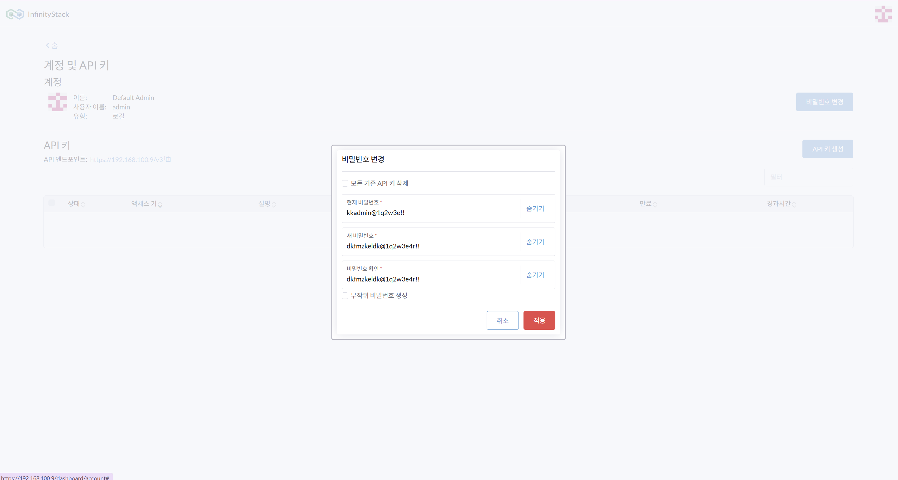
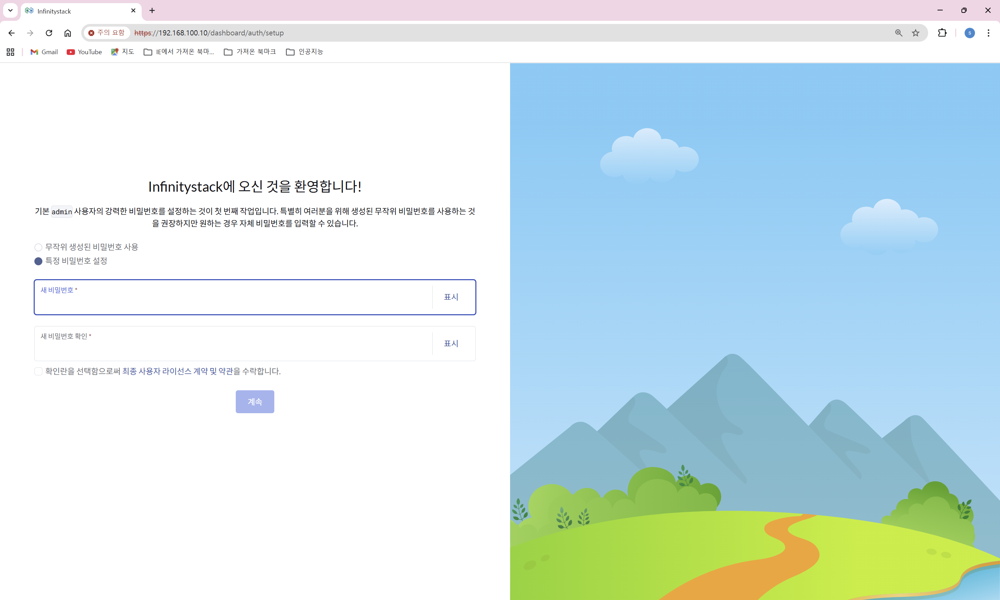

# 1. 로그인 및 암호 설정

> **초기 암호 설정 및 암호 변경으로 보안 강화**

---

## 개요

- **경로**: 계정정보 > 계정 및 API키 > 비밀번호 변경
- **목적**: 초기 Admin 계정 암호 설정 및 변경

---

## 로그인 화면



---

## 암호 변경 절차



### 단계별 설정

1. **사용자 이름 입력**: `admin` 을 입력하세요.
2. **비밀번호 입력**: 설치 시 입력한 비밀번호를 입력하세요.

    !!! note "계정 관리 확장"
        확장된 계정관리를 위해 Infinitystack은 별도의 추가적인 제품 플랜을 제시합니다.

3. **현재의 비밀번호 입력**:
    ```
    예시) kkadmin@1q2w3e!!
    ```

4. **새 비밀번호 입력**:
    ```
    예시) dkfmzkeldk@1q2w3e4r!!
    ```

5. **비밀번호 확인 입력**:
    ```
    예시) dkfmzkeldk@1q2w3e4r!!
    ```

6. **적용**을 눌러 비밀번호 변경을 완료합니다.

---

!!! tip "보안 권고사항"
    초기 설치 후 반드시 기본 비밀번호를 변경하세요. 영문 대소문자, 숫자, 특수문자를 조합한 복잡한 비밀번호 사용을 권장합니다.
