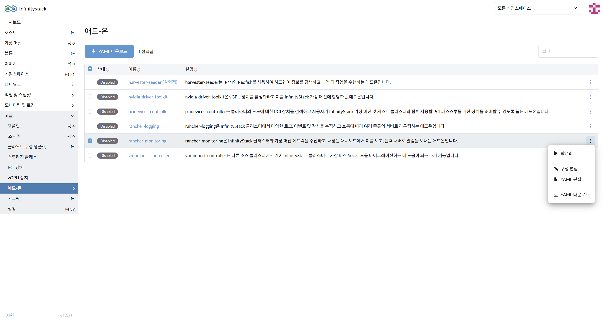
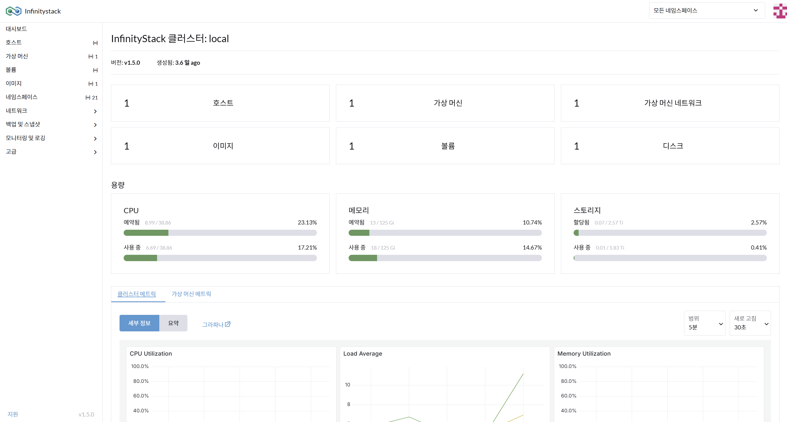

# 2. 사용자 정의 설정

> **애드-온을 활용한 대시보드 구성 확장**

---

## 개요

- **경로**: 고급 > 애드-온 > 모니터링 활성화
- **목적**: 대시보드 모니터링 시각화 구성

---

## 모니터링 애드-온 활성화

### 설정 절차

1. **애드-온 기능으로 모니터링을 활성화**합니다.
    - `rancher-monitoring`을 활성화합니다.

2. **대시보드에서 모니터링 시각화**를 확인합니다.
    - `가상 머신 메트릭`을 확인합니다.

---

## 모니터링 대시보드 확인

---

!!! info "모니터링 구성 안내"
    `rancher-monitoring` 애드-온을 활성화하면 Grafana 기반의 대시보드에서 VM CPU, 메모리, 네트워크 메트릭을 실시간으로 확인할 수 있습니다.
