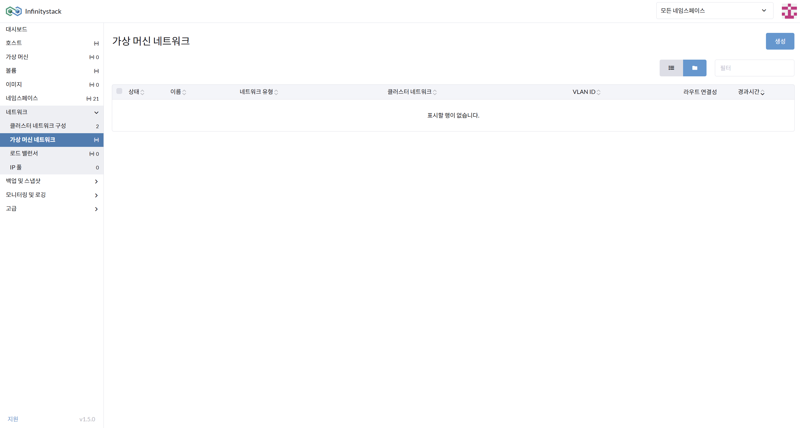
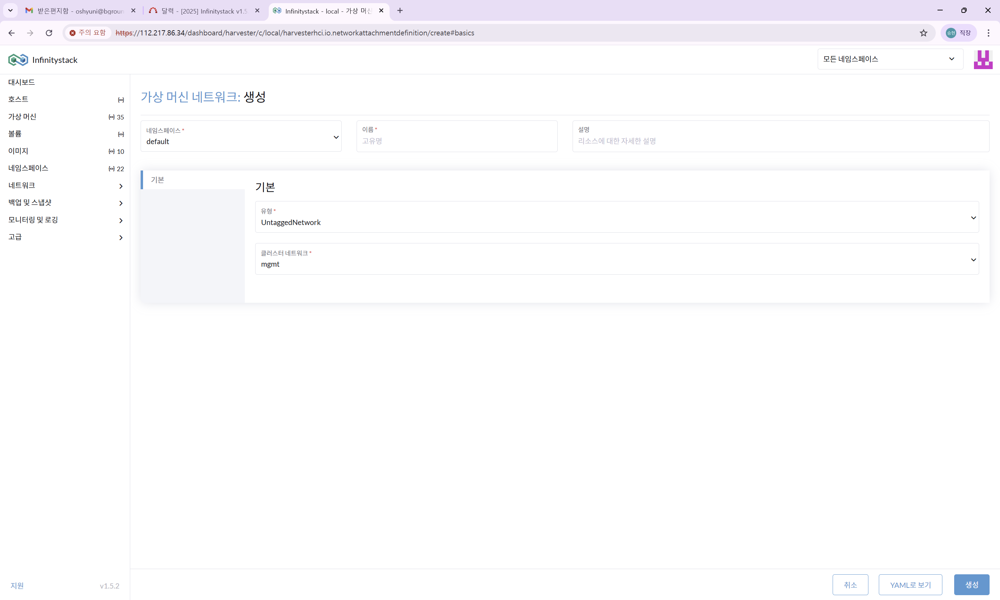

# Static IP 할당

> **Infinitystack 네트워크 구성 (Static IP 할당)**

---

## Static IP 할당 예시

아래는 전형적인 Static IP 할당 구성입니다.

| Name | Static IP | VLAN ID | 용도 |
|------|-----------|---------|------|
| HCI VIP | 172.21.1.13 | 1 | HCI Management |
| hci01 | 172.21.1.10 | 1 | HCI Host |
| hci02 | 172.21.1.11 | 1 | HCI Host |
| hci03 | 172.21.1.12 | 1 | HCI Host |
| VM#1 ~ VM#n | 172.21.1.14 ~ 172.21.1.X | 1 | 가상머신(VM) n개 만큼 |
| Storage Network | 172.21.200.0/24 | 200 | Storage |

---

## Untagged (Static IP) VM 네트워크 생성

**경로**: 네트워크 > 가상머신 네트워크

> Management 정보의 기본값을 설정합니다.

### 화면





### 절차

1. **가상머신 네트워크를 생성**합니다.
2. **네임스페이스** 선택: `default`
3. 가상머신 네트워크 **이름** 입력: `vlan1-net`
4. **기본** 항목 입력:

    | 항목 | 값 |
    |------|----|
    | 유형 | UntaggedNetwork |
    | 클러스터 네트워크 | mgmt |

    !!! info "참고"
        호스트의 관리 네트워크와 동일하게 사용하게 됩니다.

---

## VM에서 Static IP 할당 (Cloud-Init)

**경로**: 가상 머신(VM) > 클라우드 구성 / 네트워크 데이터

### 화면


### 절차

1. 가상머신에 **고정 IP 할당**을 위한 고급옵션 설정에서 **네트워크 데이터**를 작성합니다.

    !!! warning "지원 제한"
        Cloud-Init을 지원하는 VM만 설정 가능합니다.  
        **Windows**는 VNC 콘솔로 로그인 후 수동으로 직접 설정해야 합니다.

2. **Cloud-Init yaml 작성 예시**:

    ```yaml
    version: 1
    config:
      - type: physical
        name: eth0        # rocky: eth0 / ubuntu: ens0.., enp1s0..
        subnets:
          - type: static
            address: 172.21.1.14/24
            gateway: 172.21.1.1
            dns_nameservers:
              - 8.8.8.8
    ```

    !!! note "OS별 인터페이스 이름"
        - Rocky Linux: `eth0`
        - Ubuntu: `ens0..`, `enp1s0..` 등

3. 작성 후 생성합니다.

---

!!! warning "DHCP와 혼용 시 주의"
    L3 Switch의 DHCP Server와 혼용해서 사용한다면 IP 충돌 방지를 위해 **IP 목록 관리**와 **DHCP 예외IP 관리**를 반드시 설정해야 합니다.
