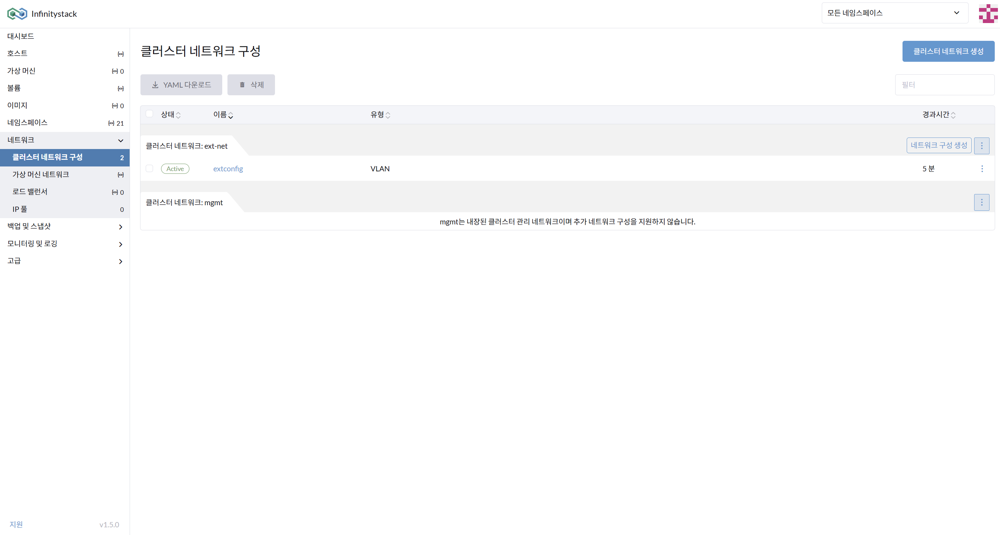
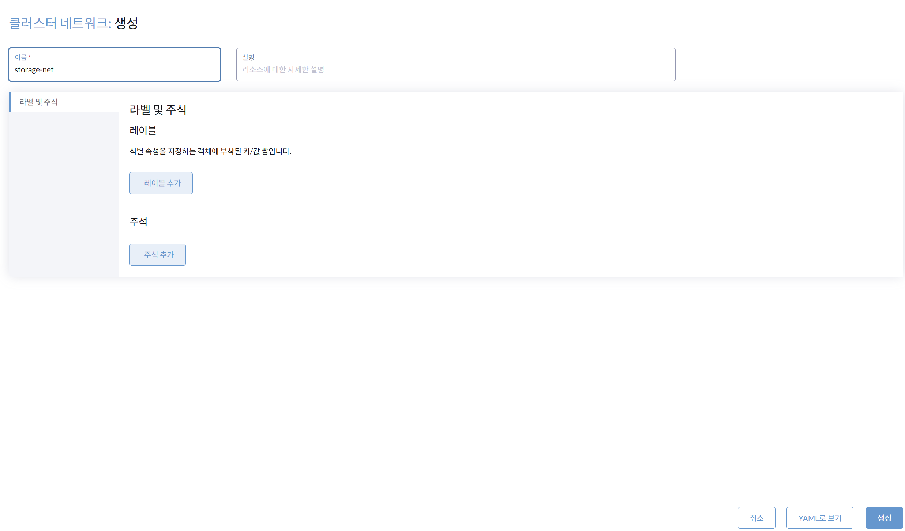
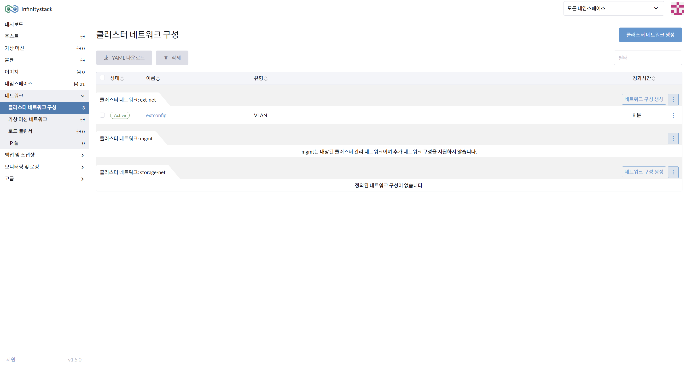
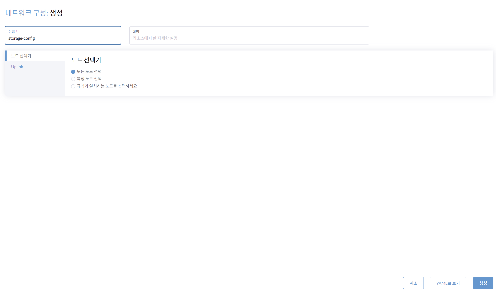
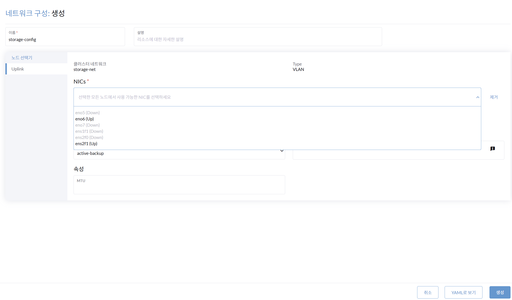
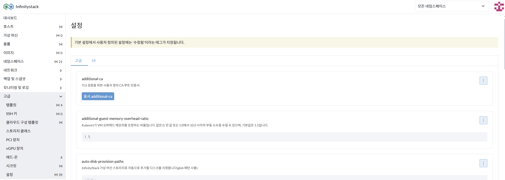
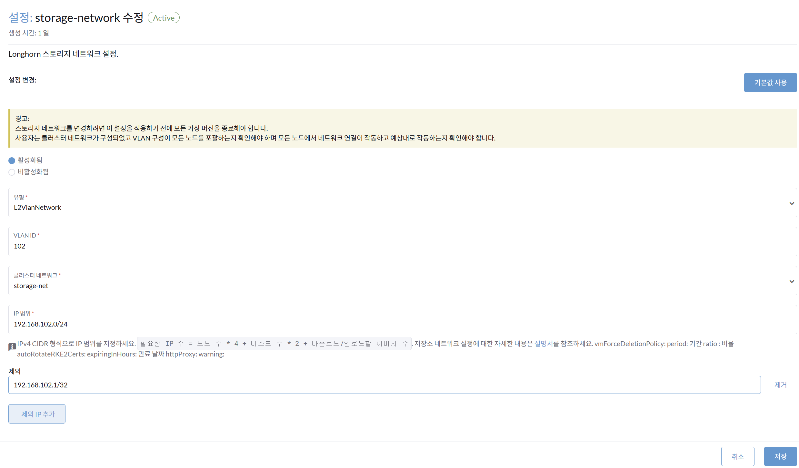

# Storage 네트워크 구성

> **클러스터 네트워크 구성에서 Storage 네트워크를 생성**

---

## 1단계: 클러스터 네트워크(storage-net) 생성

**경로**: 네트워크 > 클러스터 네트워크 구성

> storage-net은 Storage 네트워크와 연결할 클러스터 네트워크입니다.

### 화면

### 절차

1. Storage 네트워크를 연결할 **클러스터 네트워크 생성**을 선택합니다.
2. 클러스터 네트워크의 이름을 입력합니다: `storage-net`
3. `storage-net`을 생성합니다.

---

## 2단계: 네트워크 구성(storage-config) 생성

**경로**: storage-net > 네트워크 구성 생성

### 화면

### 절차

1. **네트워크 구성 생성**: 클러스터 네트워크 `storage-net`의 네트워크를 구성합니다.
2. 네트워크 이름을 입력합니다: `storage-config`
3. `storage-config`의 **노드 선택기**를 선택합니다.

    | 환경 | 노드 선택기 |
    |------|------------|
    | 클러스터 노드 | 모든 노드 선택 |
    | 싱글 노드 | 특정 노드 선택 |

---

## 3단계: Uplink 및 storage-network 설정

**경로**: 네트워크 구성 생성 > storage-config의 Uplink

### 화면

### 절차

1. `storage-config`의 **NICs**를 선택합니다: `ens2f1`
2. `storage-config`를 생성합니다.
3. **storage-network**의 연결을 설정합니다.

    **경로**: 고급 > 설정 > 고급 > storage-network

---

## 4단계: storage-network 설정 및 확인

**경로**: storage-network 설정

### 화면

### 절차

1. **활성화됨**을 선택합니다.
2. 다음 항목을 입력합니다:

    | 항목 | 값 |
    |------|----|
    | 유형 | L2VlanNetwork |
    | VLAN ID | 101 |
    | 클러스터 네트워크 | storage-net |
    | IP 범위 | 192.168.101.0/24 |
    | 제외 | 192.168.101.1/32 |

3. Storage-network 설정을 **저장**합니다.
4. storage-network의 연결을 **확인**합니다.

---

!!! success "완료"
    `storage-network`와 `storage-net` 연결을 확인합니다.
