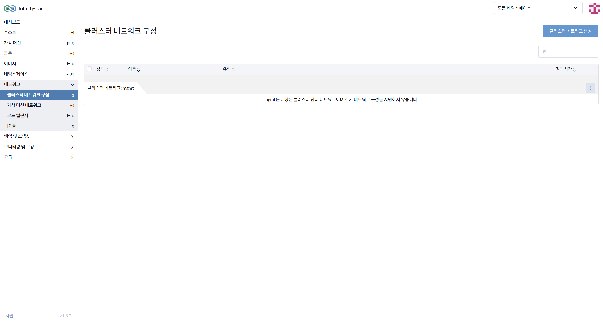
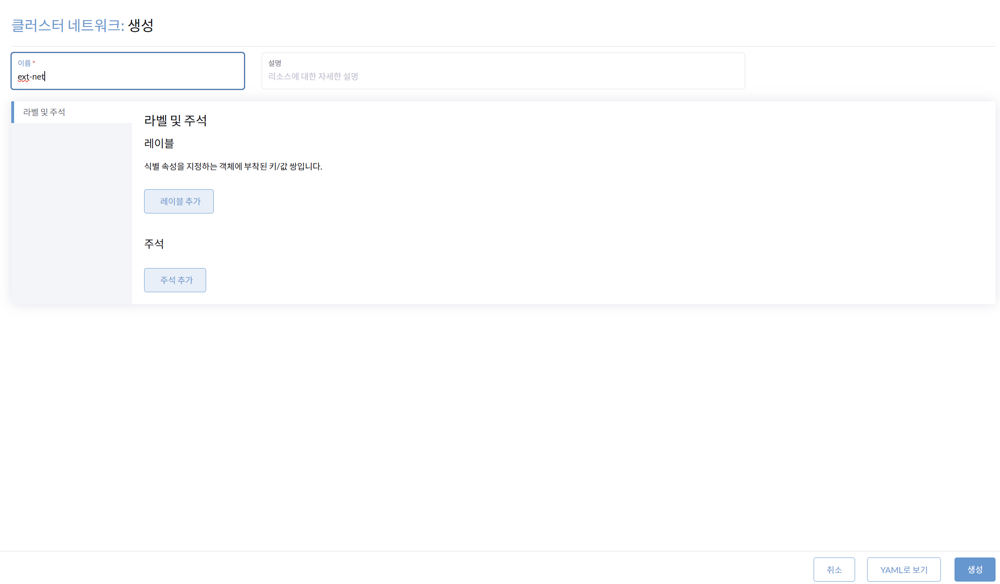
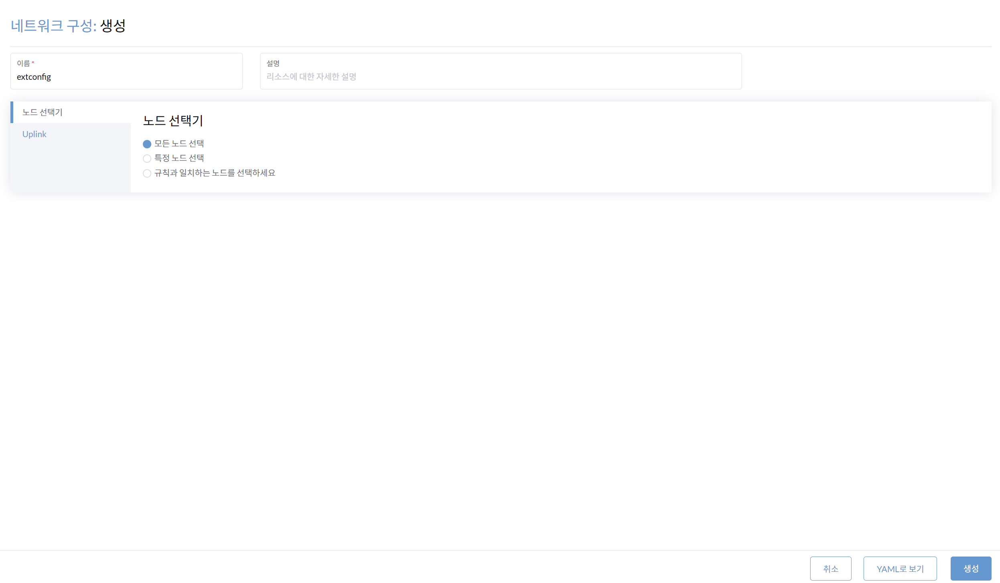
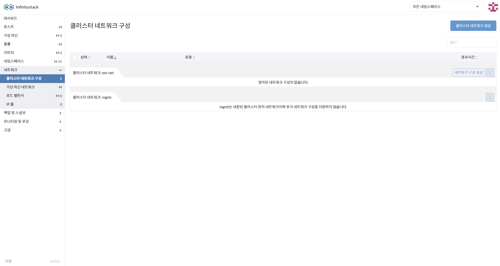
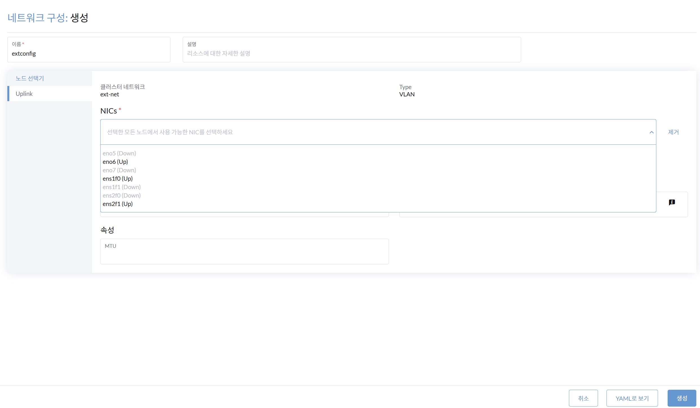
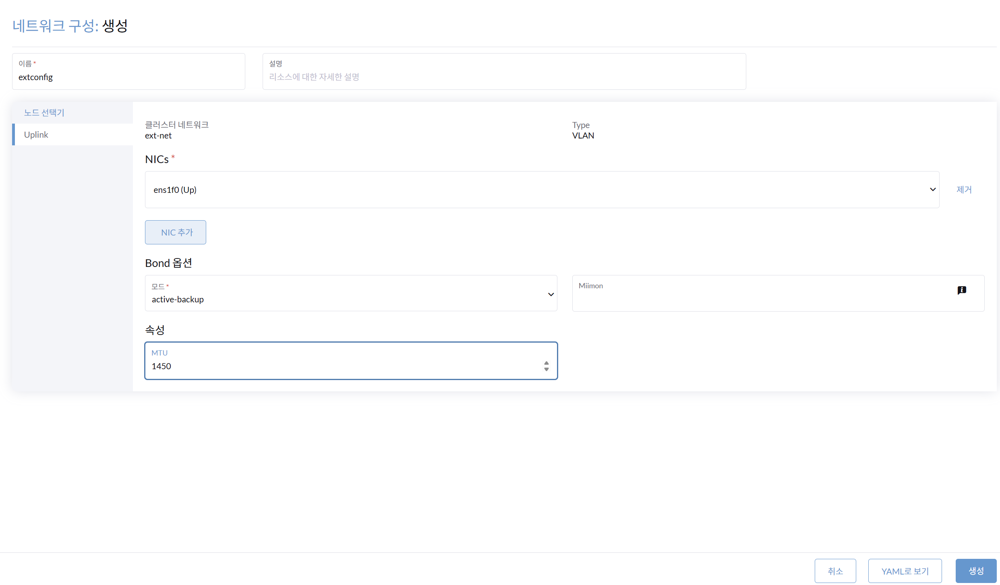
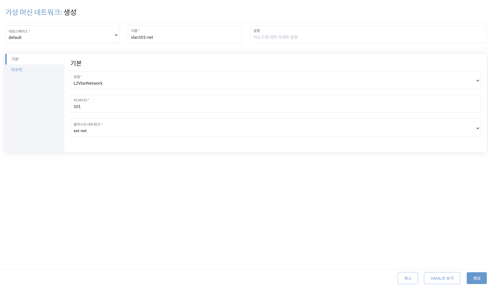
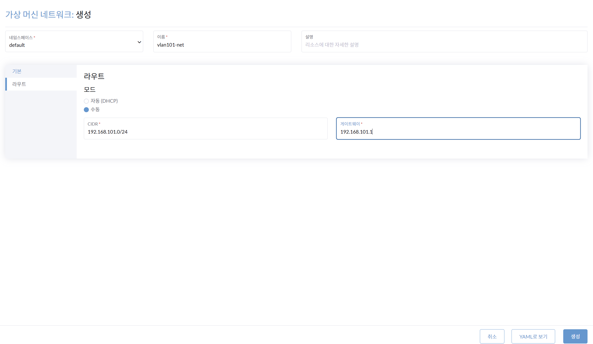

# VM 네트워크 구성

> **클러스터 네트워크 구성에서 VM 네트워크를 생성**

---

## 1단계: 클러스터 네트워크(ext-net) 생성

**경로**: 네트워크 > 클러스터 네트워크 구성

> ext-net은 VM 네트워크와 연결할 클러스터 네트워크입니다.

### 화면

### 절차

1. VM 네트워크를 연결할 **클러스터 네트워크 생성**을 선택합니다.
2. 클러스터 네트워크의 이름을 입력합니다: `ext-net`
3. `ext-net`을 생성합니다.

---

## 2단계: 네트워크 구성(extconfig) 생성

**경로**: ext-net > 네트워크 구성 생성

> 네트워크 이름과 노드 선택기를 선택합니다.

### 화면

### 절차

1. **네트워크 구성 생성**: 클러스터 네트워크 `ext-net`의 네트워크를 구성합니다.
2. 네트워크 이름을 입력합니다: `extconfig`
3. `extconfig`의 **노드 선택기**를 선택합니다.

    | 환경 | 노드 선택기 |
    |------|------------|
    | 클러스터 노드 | 모든 노드 선택 |
    | 싱글 노드 | 특정 노드 선택 |

---

## 3단계: Uplink 설정

**경로**: 네트워크 구성 생성 > extconfig의 Uplink

### 화면

### 절차

1. `extconfig`의 **NICs**를 선택합니다: `ens1f0`
2. `extconfig`의 속성 **MTU**를 입력합니다: `1500`
3. `extconfig`를 생성합니다.

---

## 4단계: 가상머신 네트워크(VLAN) 생성

**경로**: 네트워크 > 가상머신 네트워크

> VLAN 정보의 기본값을 설정합니다.

### 화면

### 절차

1. **가상머신 네트워크를 생성**합니다.
2. **네임스페이스** 선택: `default`
3. 가상머신 네트워크 **이름** 입력: `vlan102-net`
4. **기본** 항목 입력:

    | 항목 | 값 |
    |------|----|
    | 유형 | L2VlanNetwork |
    | VLAN ID | 102 |
    | 클러스터 네트워크 | ext-net |

    !!! note
        vlan 103, 104도 동일하게 생성합니다.

---

## 5단계: VLAN 라우트 설정

**경로**: 가상머신 네트워크 `vlan102-net`의 라우트 설정

### 화면

### 절차

1. `vlan102-net`의 **모드**를 선택합니다: `수동`

    !!! note
        단일 VLAN을 사용하는 경우는 **자동**으로 설정합니다.

2. **CIDR** 입력: `192.168.102.0/24`
3. **게이트웨이** 입력: `192.168.102.1`

---

!!! success "완료"
    `vlan102-net`과 `ext-net` 연결을 확인합니다.
