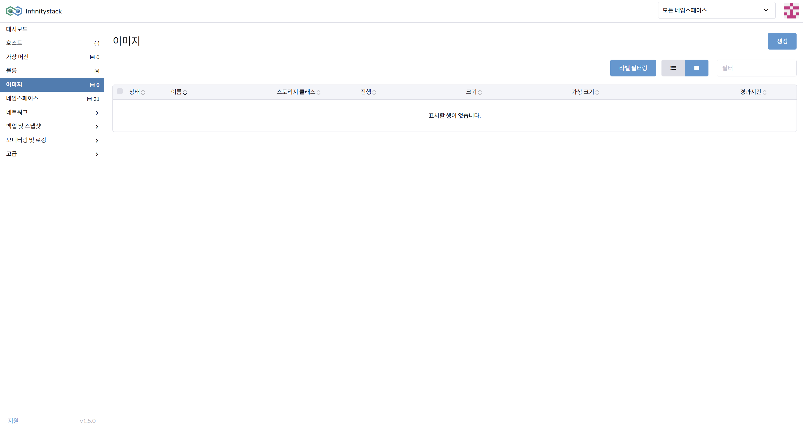
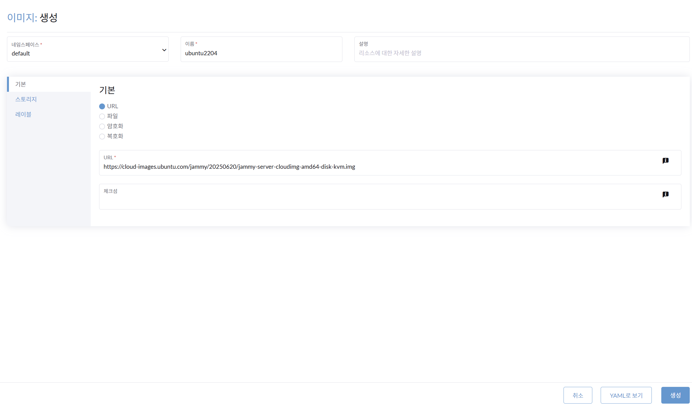
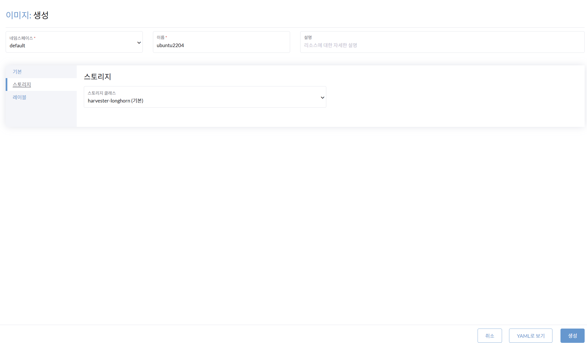
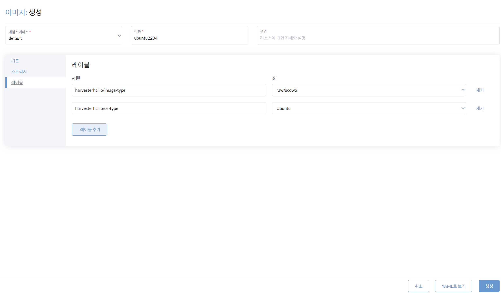
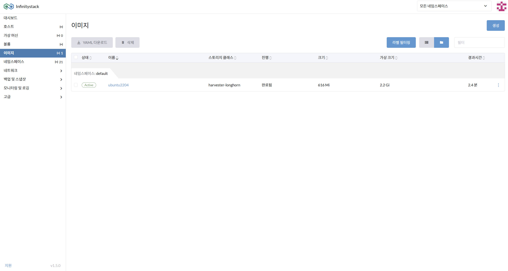

# 4. 이미지 관리

> **가상 머신(VM)의 다양한 OS 이미지 설정**

---

## 개요

Infinitystack은 SDC(소프트웨어 정의 컴퓨팅), SDS(소프트웨어 정의 스토리지), SDN(소프트웨어 정의 네트워킹)을 기반으로 다양한 OS 이미지를 지원합니다.

**지원 OS 이미지 예시:**

- Ubuntu
- Rocky Linux (RHEL 계열)
- CentOS
- SUSE Linux
- Windows Server

**지원 이미지 형식:**

- `raw`
- `qcow2`

---

## 이미지 생성 — 기본 정보

**경로**: 이미지 > 생성

### 화면





### 절차

1. 가상 머신의 OS 기반의 **이미지를 생성**합니다.
2. 이미지의 **이름** 입력: `ubuntu2204`
3. **기본 정보**: `URL`을 선택합니다.
4. **URL** 입력:

    ```
    https://cloud-images.ubuntu.com/jammy/20250620/jammy-server-cloudimg-amd64-disk-kvm.img
    ```

---

## 이미지 생성 — 레이블 및 스토리지 설정

**경로**: 이미지 > 레이블 정보 / 스토리지 정보

### 화면





### 절차

1. 이미지가 저장될 **스토리지 클래스**를 확인합니다: `harvester-longhorn (기본)`
2. 이미지의 **레이블 정보**를 확인합니다:

    | 레이블 키 | 값 |
    |----------|-----|
    | `harvesterhci.io/image-type` | `raw/qcow2` |
    | `harvesterhci.io/os-type` | `Ubuntu` |

3. **이미지를 생성**합니다.

---

## 이미지 상태 점검

**경로**: 이미지 > 상태 점검

### 화면



### 확인

생성된 이미지가 정상적으로 적재되었는지 확인합니다.

- 상태가 `Active`로 표시되면 정상입니다.

---

!!! tip "이미지 관리 팁"
    이미지 URL은 공식 클라우드 이미지 배포 사이트에서 최신 버전을 확인하세요.  
    - Ubuntu Cloud Images: [https://cloud-images.ubuntu.com](https://cloud-images.ubuntu.com)  
    - Rocky Linux: [https://rockylinux.org/download](https://rockylinux.org/download)
