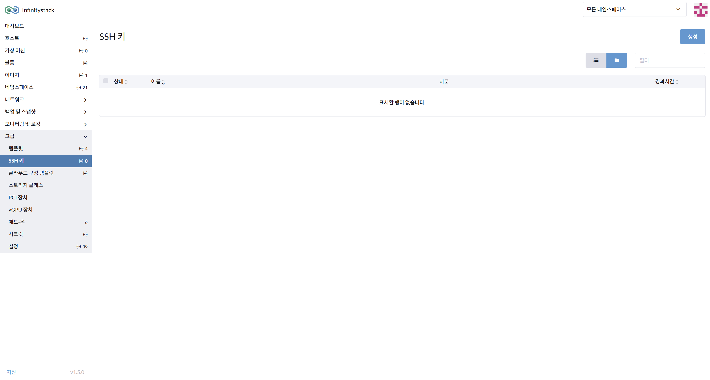
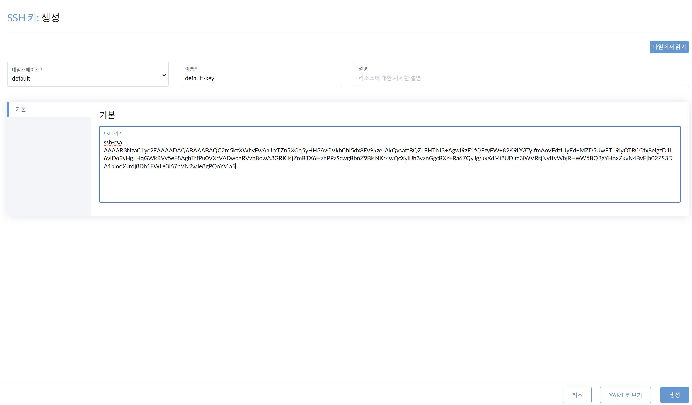

# 5. SSH 키 관리

> **가상 머신(VM)의 보안접속을 위한 SSH 키 관리**

---

## 개요

SSH 키 인증 방식을 사용하면 비밀번호 없이 안전하게 가상 머신에 접속할 수 있습니다.

```
로컬 PC  ──[SSH Private Key]──▶  Infinitystack VM
                                   (Public Key 등록됨)
```

---

## SSH 키 생성 (로컬)

**경로**: 로컬 터미널에서 실행

### 화면





### 절차

1. **SSH 키 로컬 생성**:

    ```bash
    ssh-keygen -t rsa -b 4096 -C "infinitystack@bground.ai"
    ```

    !!! info "저장 위치"
        기본값: `/home/your_user/.ssh/id_rsa` (또는 `~/.ssh/id_rsa`)

2. **Private key 확인**:

    ```bash
    cat ~/.ssh/id_rsa
    ```

3. **Public key 확인**:

    ```bash
    cat ~/.ssh/id_rsa.pub
    ```

---

## SSH 키 등록 (Infinitystack)

**경로**: 고급 > SSH 키

### 화면


### 절차

1. 가상 머신으로 원격 접속할 때 필요한 **보안키(SSH키)를 생성**합니다.
2. **네임스페이스** 입력: `default`
3. **SSH 키 이름** 입력: `default-key`
4. **SSH 키** 입력: `~/.ssh/id_rsa.pub`의 내용(ssh-rsa public 값)을 붙여넣습니다.

    ```bash
    # Public key 내용 확인 후 복사
    cat ~/.ssh/id_rsa.pub
    ```

    !!! example "Public Key 예시 형식"
        ```
        ssh-rsa AAAAB3NzaC1yc2EAAAADAQABAAACAQ... infinitystack@bground.ai
        ```

---

!!! warning "Private Key 보안"
    Private Key(`id_rsa`)는 절대 외부에 공유하지 마세요. Public Key(`id_rsa.pub`)만 Infinitystack에 등록합니다.

!!! tip "SSH 접속 방법"
    VM 생성 시 SSH 키를 지정했다면, 별도의 SSH 클라이언트(예: PuTTY, Terminal)를 사용하여 다음과 같이 접속합니다:
    ```bash
    ssh -i ~/.ssh/id_rsa ubuntu@<VM_IP>
    ```
