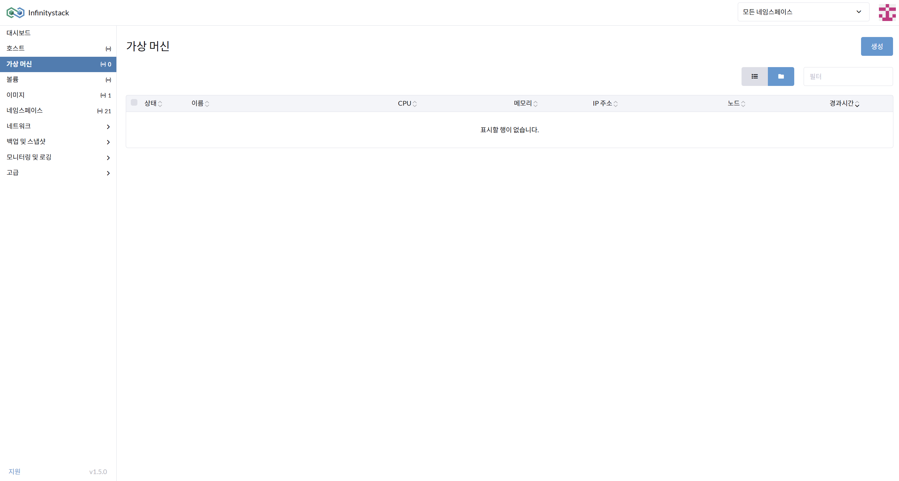
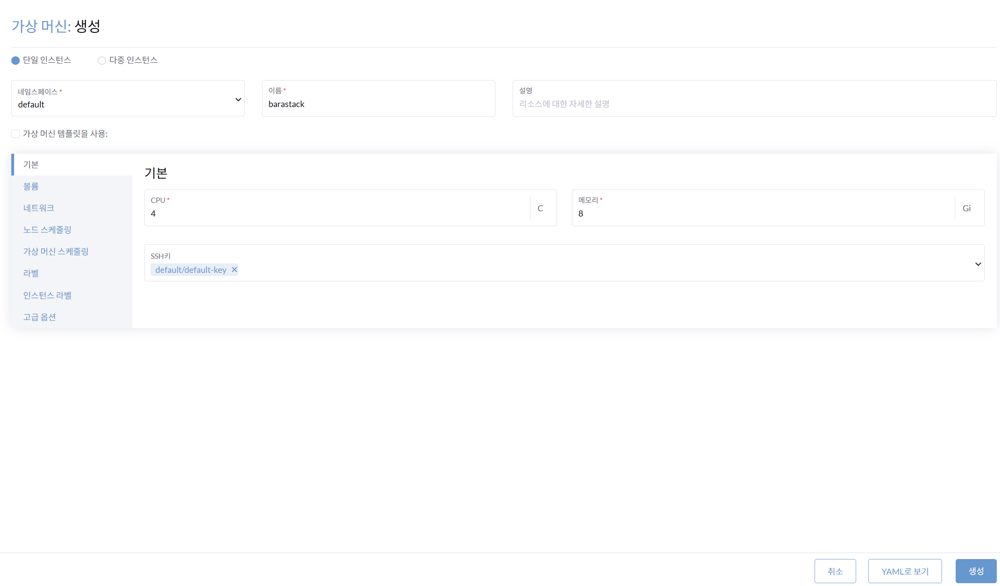
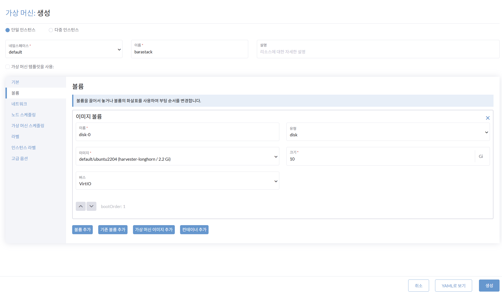
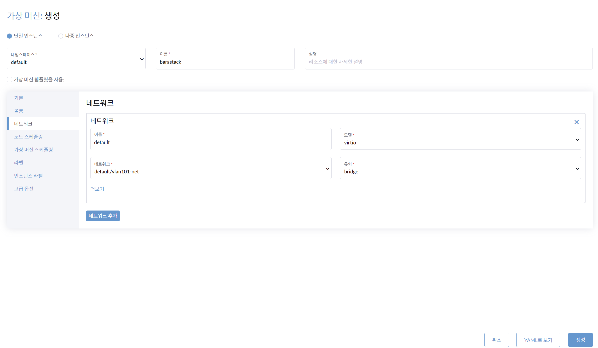
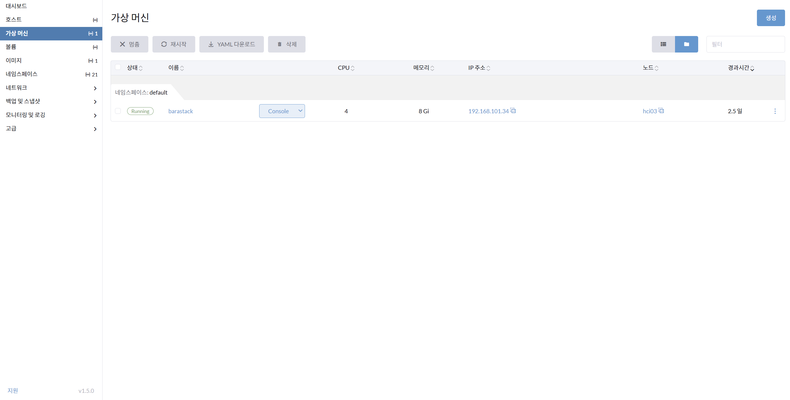

# VM 생성

> **가상 머신(VM)의 쉽고 편리한 생성 관리**

---

## VM 생성 — 기본 정보

**경로**: 가상 머신(VM)

### 화면

### 절차

1. **가상 머신(VM)을 생성**합니다.
2. **네임스페이스** 입력: `default`
3. 가상 머신 **이름** 입력: 예시) `barastack`
4. **기본 정보** 입력:

    | 항목 | 예시 값 |
    |------|---------|
    | CPU | `4` vCPU |
    | 메모리 | `8` GB |
    | SSH 키 | `default/default-key` |

---

## VM 생성 — 볼륨 및 네트워크 (DHCP IP)

**경로**: 가상 머신(VM) 생성 > 볼륨 / 네트워크

### 화면

### 볼륨 설정

| 항목 | 값 |
|------|-----|
| 이미지 볼륨 이름 | `disk-0` |
| 유형 | `disk` |
| 이미지 | `default/ubuntu2204` |
| 볼륨 크기 | `10` GB |

!!! info "볼륨 추가 안내"
    생성된 볼륨은 OS 영역입니다. Disk를 추가하려면 볼륨 생성을 선행으로 작업하고 볼륨 추가를 수행해야 합니다.

### 네트워크 설정 (DHCP)

| 항목 | 값 |
|------|-----|
| 네트워크 이름 | `default` |
| 네트워크 모델 | `virtio` |
| 네트워크 | `default/vlan101-net` |

!!! note
    다른 VM 가상 네트워크 연결이 필요할 때 네트워크를 추가합니다.

---

## VM 상태 확인 (DHCP IP)

**경로**: 가상 머신(VM) > 상태 확인

### 화면

### 확인 항목

- 상태: `Running` 확인
- IP 주소: `192.168.101.34` 할당 여부 확인
- `Console`로 원격 접속 가능

!!! info "IP 할당 방식"
    L3 Switch의 DHCP Server에서 IP를 할당합니다.  
    VM을 SSH 키로 생성했다면, 별도 SSH 키로 접속할 수 있는 접속 도구를 사용해야 합니다.
