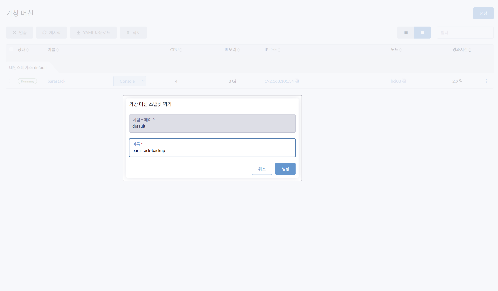
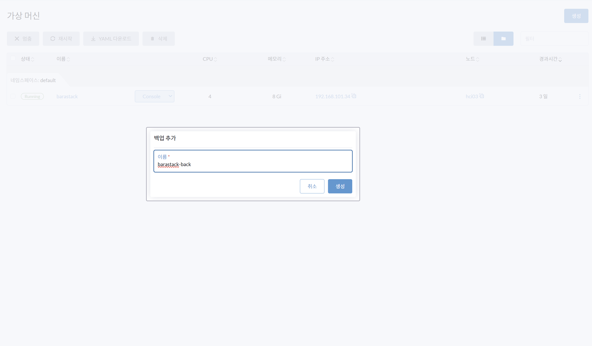

# VM 스냅샷 및 백업

> **가상 머신(VM)의 스냅샷과 백업 관리**

---

## 스냅샷 생성

**경로**: 가상 머신(VM) > 스냅샷 찍기

### 화면

### 절차

1. 가상 머신(VM)의 **가상머신 스냅샷 찍기**를 선택합니다.
2. **가상머신 스냅샷 이름** 입력: 예시) `barastack-backup`

---

## VM 백업 받기

**경로**: 가상 머신(VM) > 백업받기

### 화면

### 절차

1. 가상 머신(VM)의 **백업받기**를 선택합니다.
2. **백업추가 이름** 입력: 예시) `barastack-back`

    !!! success "백업 확인"
        백업 추가 생성이 성공적으로 이루어졌다는 메시지가 나오면,  
        좌측 메인 메뉴: **백업 및 스냅샷 > 가상머신 백업**에서 조회 가능합니다.

---

!!! tip "스냅샷 vs 백업"
    | 구분 | 스냅샷 | 백업 |
    |------|--------|------|
    | 저장 위치 | 동일 스토리지 | 외부 백업 서버 (S3/NFS) |
    | 복구 속도 | 빠름 | 상대적으로 느림 |
    | 장애 대응 | 소프트 장애 | 하드 장애 포함 |
    | 설정 방법 | VM 메뉴에서 직접 | backup-target 사전 설정 필요 |
