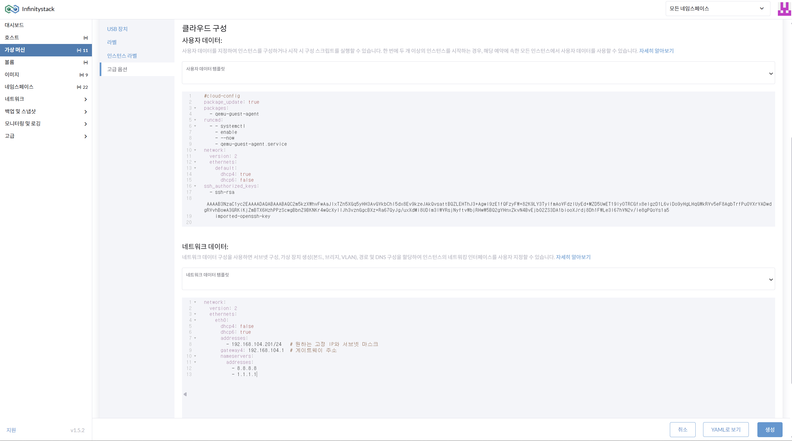

# VM Static IP 할당

> **가상 머신(VM)의 쉽고 편리한 Static IP 할당 관리**

---

## 개요

**경로**: 가상 머신(VM) > 클라우드 구성 (STATIC IP 할당) / 네트워크 데이터 (STATIC IP 할당)

### 화면



---

## 설정 절차

1. 가상머신에 **고정 IP 할당**을 위한 고급옵션 설정에서 **네트워크 데이터**를 작성합니다.

    !!! warning "지원 제한"
        Cloud-Init을 지원하는 VM만 설정 가능합니다.  
        **Windows**는 VNC 콘솔로 로그인 후 수동으로 직접 설정해야 합니다.

2. **Cloud-Init yaml 예시** (제시된 양식을 준용하여 작성):

    === "Rocky Linux (eth0)"
        ```yaml
        version: 1
        config:
          - type: physical
            name: eth0
            subnets:
              - type: static
                address: 172.21.1.14/24
                gateway: 172.21.1.1
                dns_nameservers:
                  - 8.8.8.8
        ```

    === "Ubuntu (enp1s0)"
        ```yaml
        version: 1
        config:
          - type: physical
            name: enp1s0
            subnets:
              - type: static
                address: 172.21.1.14/24
                gateway: 172.21.1.1
                dns_nameservers:
                  - 8.8.8.8
        ```

    !!! note "OS별 인터페이스 이름"
        - Rocky Linux: `eth0`
        - Ubuntu: `ens0..`, `enp1s0..` 등 (시스템마다 다를 수 있음)

3. 작성 후 **생성**합니다.

---

!!! warning "DHCP Server와 혼용 시 주의"
    L3 Switch의 DHCP Server와 혼용해서 사용한다면 IP 충돌 방지를 위해 다음 두 가지를 반드시 설정해야 합니다:
    
    - **IP 목록 관리**
    - **DHCP 예외IP 관리**
