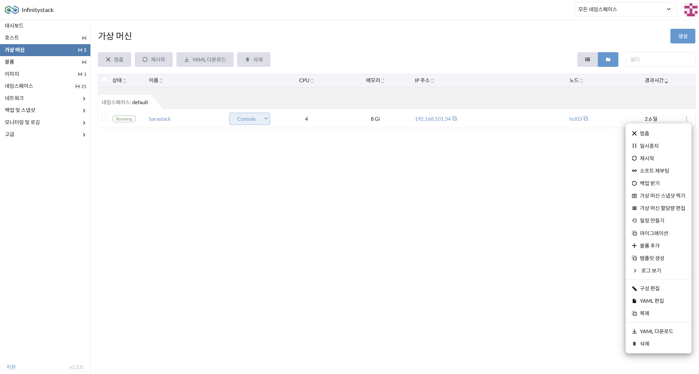
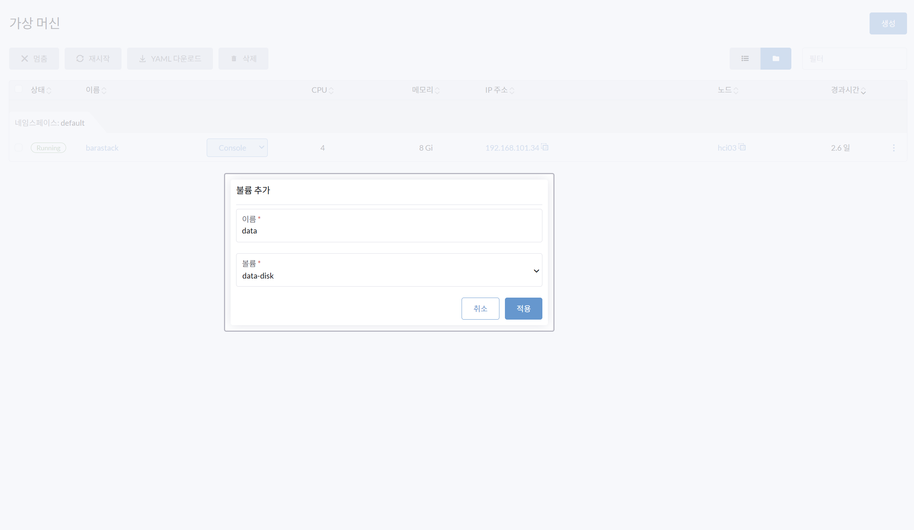
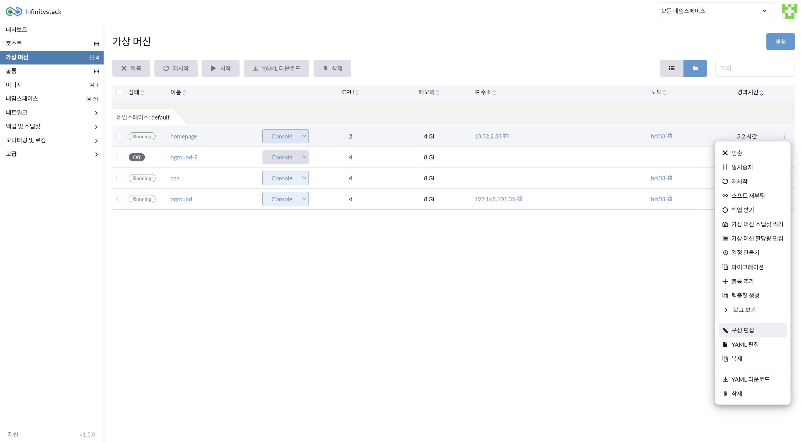
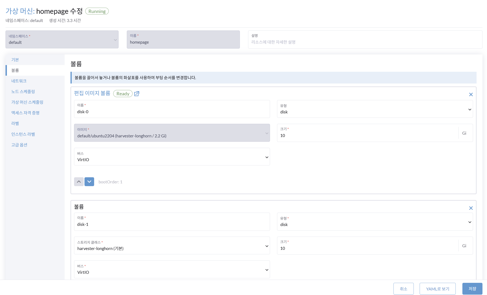
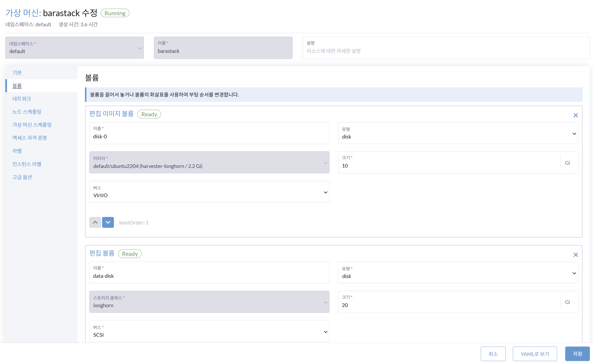

# VM 볼륨 추가

> **가상 머신(VM)의 Disk 확장**

---

## 방법 1: 사전 생성 볼륨 추가

**경로**: 가상 머신(VM) > 볼륨추가

### 화면





### 절차

1. VM의 Disk를 확장하기 위해 **볼륨추가**를 선택합니다.
2. **볼륨 추가 이름** 입력: 예시) `data`
3. **볼륨 선택**: `data-disk`를 선택합니다.

    !!! info "사전 준비"
        볼륨 메뉴에서 미리 생성한 볼륨 `data-disk`를 조회한 후 선택합니다.

4. VM에 볼륨추가를 **적용**합니다.

---

## 방법 2: 직접 볼륨 추가 (구성편집)

**경로**: 가상 머신(VM) > 볼륨추가 (직접추가)

### 화면





### 절차

1. VM의 Disk를 직접 확장하기 위해 **구성편집**을 선택합니다.
2. 다음 항목을 입력합니다:

    | 항목 | 값 |
    |------|-----|
    | 볼륨 이름 | `data` |
    | 스토리지 클래스 | `harvester-longhorn (기본)` |
    | 볼륨 크기 | `10` GB |
    | 볼륨 버스 | `VirtIO` |

---

## 볼륨 추가 확인 — 버스 선택

**경로**: 가상 머신(VM) 볼륨 추가 확인 > 구성편집

### 화면



### 절차

1. 볼륨 추가를 확인하기 위해 **구성편집**을 선택합니다.
2. **볼륨 버스** 선택: `VirtIO`

    !!! info "VirtIO 드라이버"
        VM이 KVM/QEMU에 특화된 고성능 가상 디스크 드라이버 방식입니다.

3. 수정된 내용을 **저장**합니다.

    !!! warning
        저장 후 VM은 재시작됩니다.

---

## 볼륨 마운트 — 방법 1 (파티션 방식)

**경로**: VM 내부 Linux 콘솔

### 절차

1. **Disk 확인**:
    ```bash
    lsblk
    # 추가된 볼륨 vdc 확인
    ```

2. **파티션 생성**:
    ```bash
    sudo fdisk /dev/vdc
    ```
    - `n` → 새 파티션 생성
    - `p` → 주 파티션 선택
    - 파티션 번호, 시작/끝 섹터는 기본값 사용
    - `w` → 변경 사항 저장

3. **파티션 확인**:
    ```bash
    lsblk
    ```

4. **파일 시스템 포맷**:
    ```bash
    sudo mkfs -t ext4 /dev/vdc1
    ```

5. **마운트**:
    ```bash
    sudo mkdir /mnt/data
    sudo mount /dev/vdc1 /mnt/data
    df -h
    ```

6. **자동 마운트 설정**:
    ```bash
    # UUID 획득
    sudo blkid /dev/vdc1
    # 예: UUID="bf68866a-0404-4978-a78b-417bb3de058a"

    # /etc/fstab 편집
    sudo vi /etc/fstab
    # 아래 내용 추가:
    # UUID="bf68866a-0404-4978-a78b-417bb3de058a" /mnt/data ext4 defaults 0 0
    ```

---

## 볼륨 마운트 — 방법 2 (LVM 방식)

**경로**: VM 내부 Linux 콘솔

### 절차

1. **Disk 확인**:
    ```bash
    lsblk
    # 추가된 볼륨 vdb 확인
    ```

2. **LVM2 설치**:
    ```bash
    sudo apt update && sudo apt install lvm2 -y
    ```

3. **Physical Volume (PV) 생성**:
    ```bash
    sudo pvcreate /dev/vdb
    ```

4. **Volume Group (VG) 생성**:
    ```bash
    sudo vgcreate infinity-vg /dev/vdb
    ```

5. **Logical Volume (LV) 생성** (10G보다 작게):
    ```bash
    sudo lvcreate -L 9.9G -n data-lv infinity-vg
    ```

6. **마운트 디렉토리 생성 및 마운트**:
    ```bash
    sudo mkdir /mnt/data
    sudo mkfs.ext4 /dev/infinity-vg/data-lv
    sudo mount /dev/infinity-vg/data-lv /mnt/data
    ```

7. **자동 마운트 설정**:
    ```bash
    # UUID 획득
    sudo blkid /dev/infinity-vg/data-lv
    # 예: UUID="cf5289bb-c4da-472a-8041-e8d88f0be1a6"

    # /etc/fstab 편집
    sudo vi /etc/fstab
    # 아래 내용 추가:
    # UUID="cf5289bb-c4da-472a-8041-e8d88f0be1a6" /mnt/data ext4 defaults 0 0
    ```
