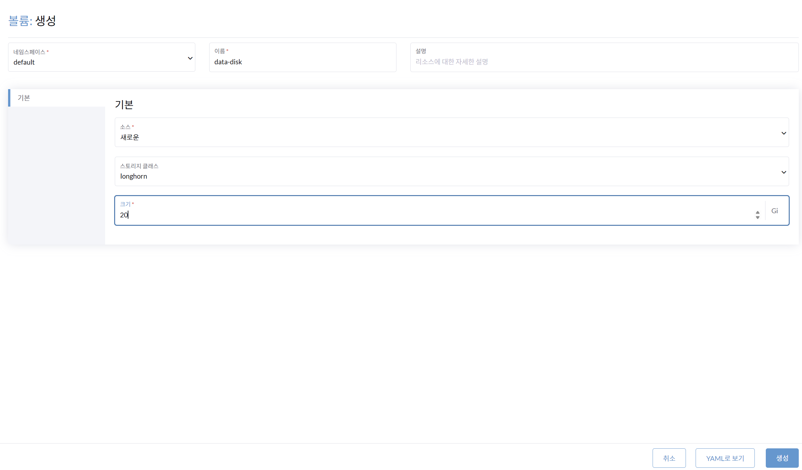
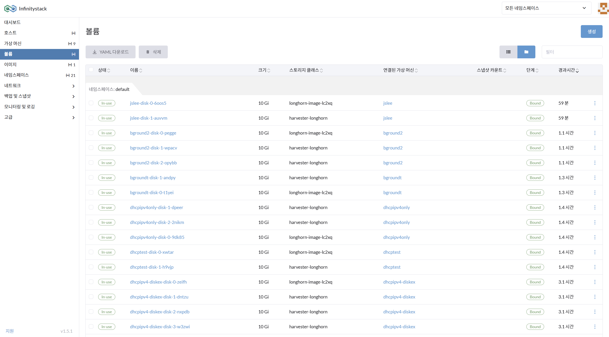
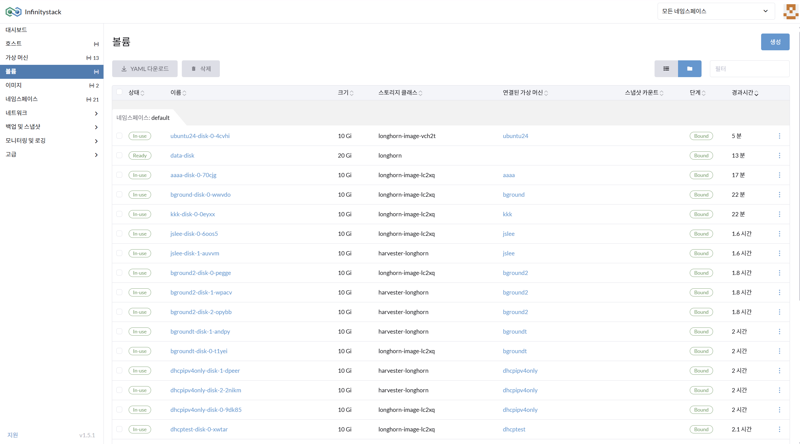
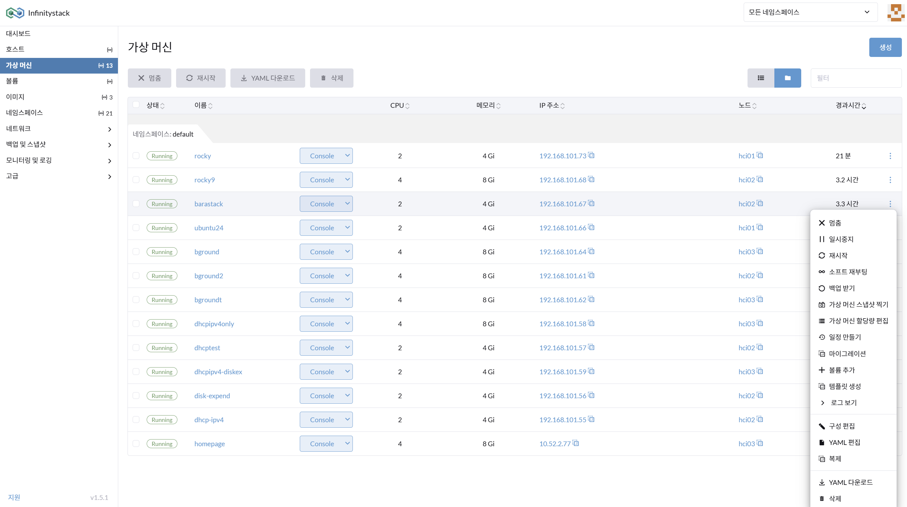
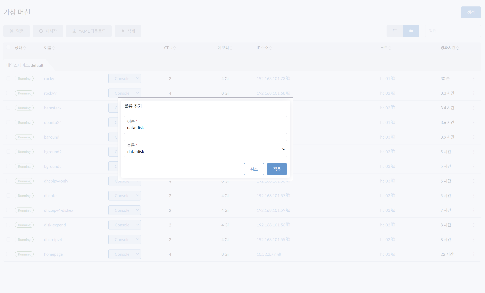

# 7. 볼륨 관리

> **가상 머신(VM)의 신속한 DISK 관리**

---

## 개요

볼륨(Volume)은 가상 머신에 추가로 할당할 수 있는 스토리지 단위입니다. Infinitystack은 Longhorn 기반의 소프트웨어 정의 스토리지(SDS)를 사용합니다.

```
Infinitystack
    └── Storage Volume (Longhorn SDS)
            ├── data-disk (20GB)
            └── VM: barastack
```

---

## 볼륨 생성

**경로**: 볼륨

### 화면





### 절차

가상 머신(VM)에 disk를 추가 할당하기 위한 **선행 작업**입니다.

1. **네임스페이스 / 볼륨 이름** 입력:
    - 네임스페이스: `default`
    - 볼륨 이름: `data-disk`

2. **기본 소스** 입력: `새로운`

3. **스토리지 클래스** 입력: `longhorn`

4. **크기(Disk Size)** 입력: `20` GB

---

## VM에 볼륨 추가

**경로**: 볼륨 > VM에 볼륨 추가

### 화면





### 절차

1. 가상머신 `barastack`을 선택하고 **편집모드**에서 **볼륨추가**를 선택합니다.
2. 추가할 볼륨의 이름 `data-disk`를 입력합니다.
3. 이미 생성한 볼륨 `data-disk`를 선택하고 **적용**을 누르면 가상머신에 마운트됩니다.

---

## 볼륨 추가 확인

**경로**: 볼륨 > VM에 볼륨 추가 적용

### 화면



### 확인

- 볼륨이 정상적으로 VM에 마운트되었는지 확인합니다.
- VM 내부에서 `lsblk` 명령으로 새로운 디스크 장치가 보이면 성공입니다.

    ```bash
    lsblk
    # vdb 또는 vdc 등 새 디스크 확인
    ```

---

!!! tip "볼륨 마운트 방법"
    볼륨을 VM에 추가한 후 실제 사용을 위해서는 VM 내부에서 마운트 작업이 필요합니다.  
    자세한 마운트 절차는 [VM 볼륨 추가 - 마운트 방법](06-vm/volume.md)을 참고하세요.
