# 8. 로드밸런서 관리

> **가상 머신(VM)의 로드밸런스 제공**

---

## 개요

Infinitystack의 로드밸런서는 **Mgmt Network** 기반으로 서비스를 제공합니다.

```
외부 사용자
    │
    ▼
로드밸런서 (192.168.100.11:8080)
    │
    ├── VM: homepage (10.x.x.x / management Network)
    └── VM: homepage-2 (10.x.x.x / management Network)

Mgmt Network (VLAN100): 192.168.100.0/24
```

---

## 사전 준비: VM에 Mgmt Network 연결 확인

**경로**: 가상머신 > Mgmt Network 기반의 생성

### 화면

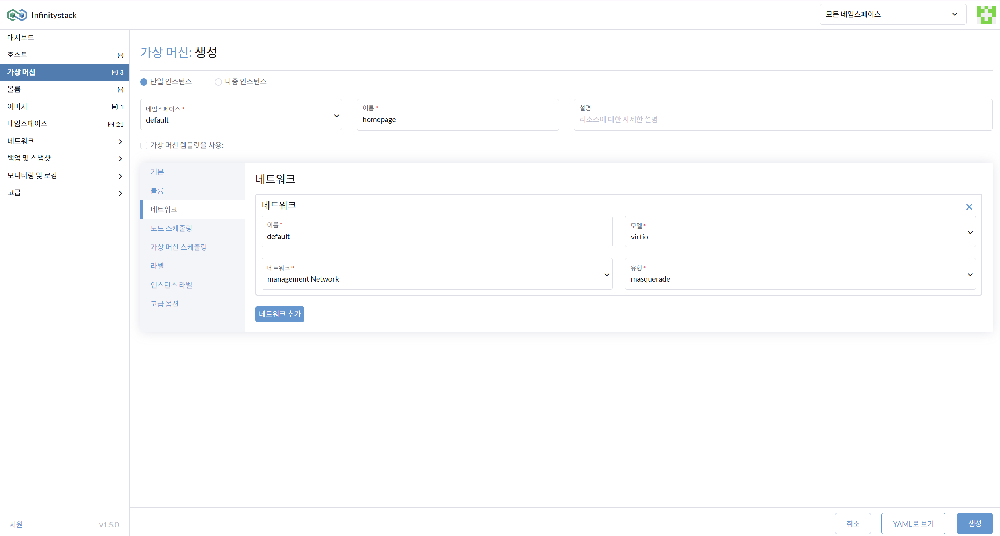

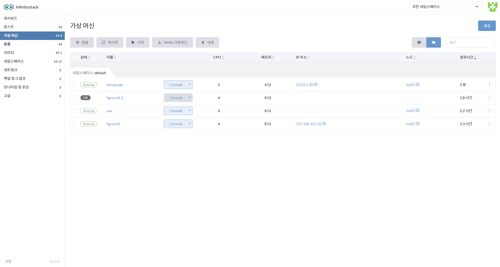

### 절차

1. **가상머신 생성 > 네트워크 선택**: `management Network`를 선택합니다.

    !!! info "Management Network IP 대역"
        management Network 대역은 Infinitystack 내부의 Reserved된 IP 대역: `10.x.x.x`

2. `management Network` IP 대역 (`10.x.x.x`)을 확인합니다.

---

## IP 풀(Pool) 구성

**경로**: 네트워크 > IP 풀

> 로드밸런서에서 풀 방식으로 적용할 때 사용합니다.

### 화면

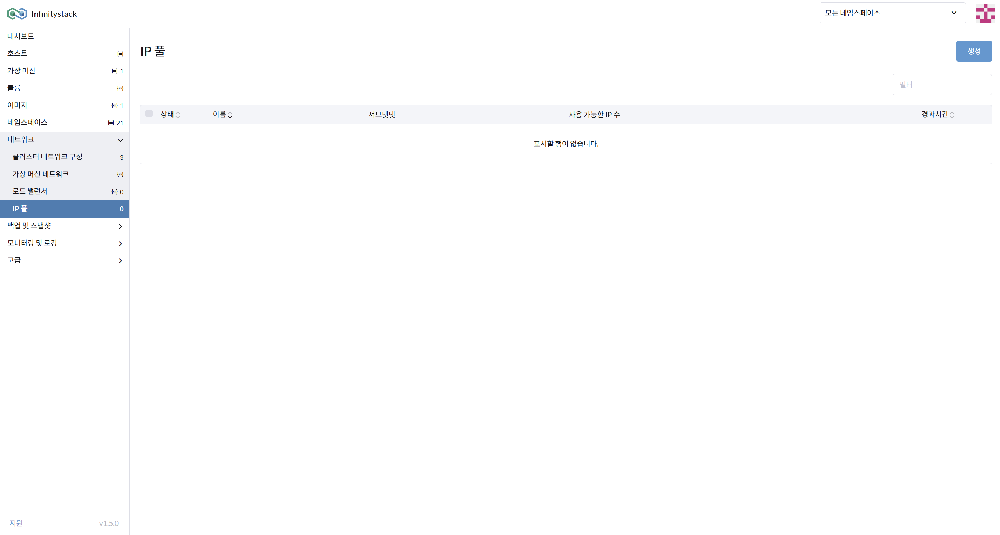

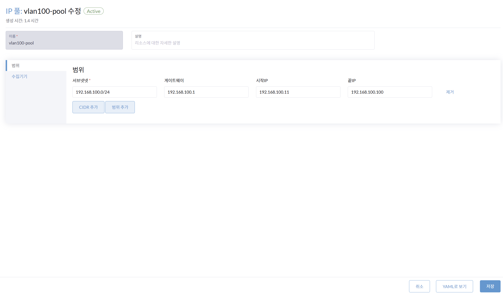

### 절차

1. **IP 풀 이름** 입력: `vlan100-pool`

    !!! note
        L3 Switch의 vlan100의 Mgmt Network만 사용합니다.

2. **범위 추가 서브넷** 입력: `192.168.100.0/24`
3. **게이트웨이** 입력: `192.168.100.1`
4. **시작/끝 IP** 입력:
    - 시작: `192.168.100.11`
    - 끝: `192.168.100.100`

---

## IP 풀 상태 확인 및 수집기 설정

**경로**: IP 풀 > 상태 확인 / 수집기

### 화면

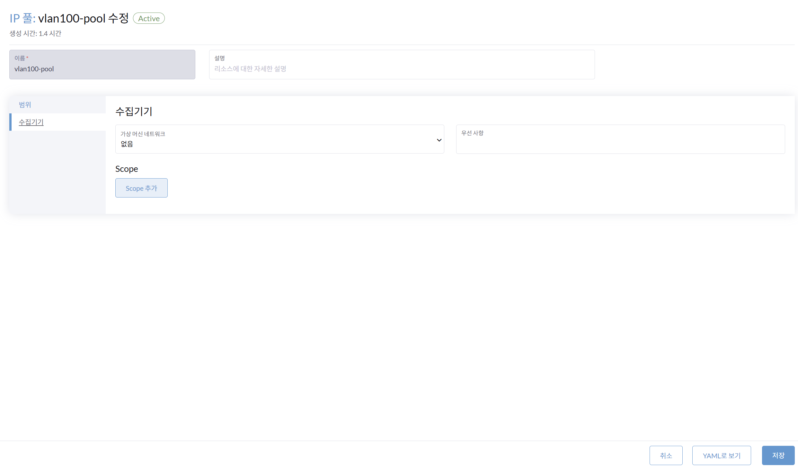

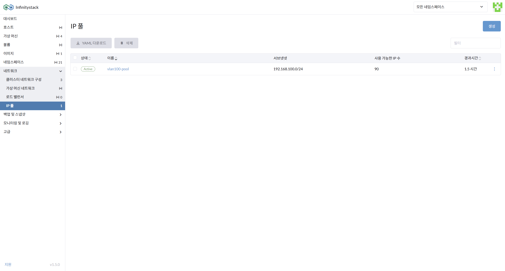

### 확인 사항

- `management Network`를 사용하는 IP풀은 **수집기의 가상머신 네트워크를 선택하지 않습니다**.
- IP 풀의 **상태를 확인**합니다.

---

## 로드밸런서 생성 — 기본 정보

**경로**: 네트워크 > 로드 밸런서

### 화면

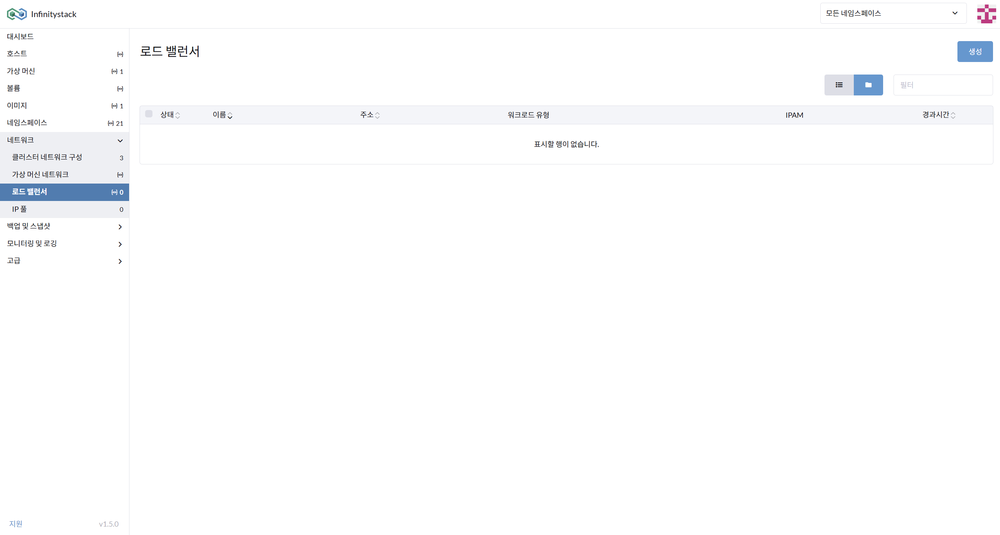

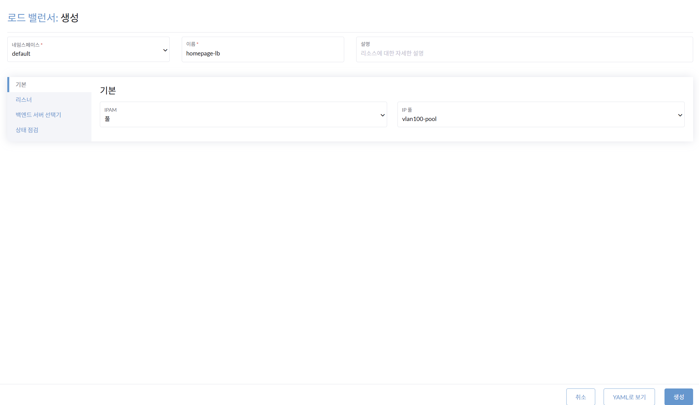

### 절차

1. **로드밸런서 이름** 입력: 예시) `homepage-lb`
2. **기본정보 IPAM** 입력: `풀`
3. **IP 풀** 입력: `vlan100-pool`

---

## 로드밸런서 생성 — 리스너 및 백엔드 설정

**경로**: 로드밸런서 생성 > 리스너 / 백엔드 서버 선택기

### 화면

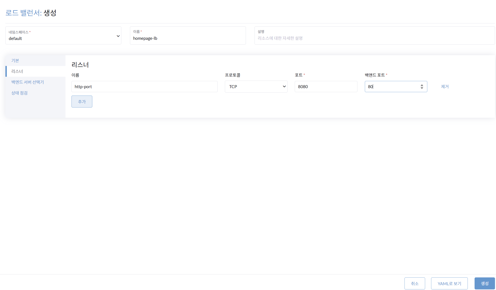

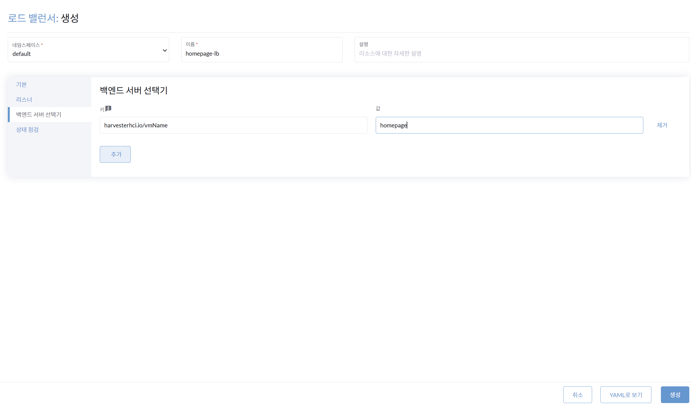

### 절차

**리스너 설정:**

| 항목 | 값 |
|------|-----|
| 리스너 이름 | `http-port` |
| 프로토콜 | `TCP` |
| 포트 | `8080` |
| 백엔드 포트 | `80` |

**백엔드 서버 선택기:**

| 항목 | 값 |
|------|-----|
| 키 | `harvesterhci.io/vmName` |
| 값 | `homepage` |

!!! info "상태 변화"
    백엔드 서버가 성공적으로 연결되면 `Not Ready`에서 `Active`로 변경됩니다.

---

## 로드밸런서 접속 확인

**경로**: 로드밸런서 > 확인

### 화면

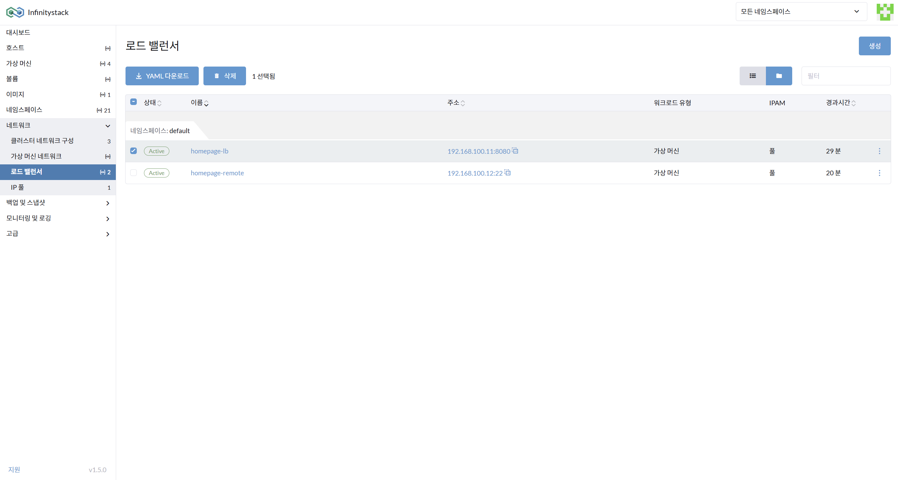

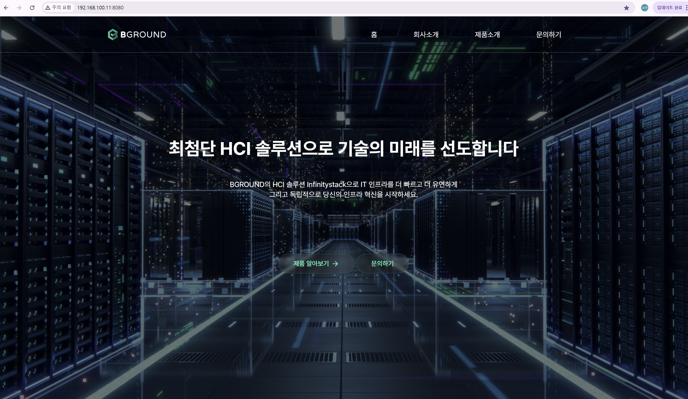

### 확인 방법

| 서비스 | 접속 주소 | 용도 |
|--------|----------|------|
| `homepage-lb` | `http://192.168.100.11:8080` | 웹 서비스 접속 |
| `homepage-remote` | `192.168.100.12:22` | VM 원격 접속 (SSH) |

1. **웹 서비스 접속** 확인: `http://192.168.100.11:8080`
2. **VM 원격 접속** 확인: `ssh user@192.168.100.12 -p 22`
