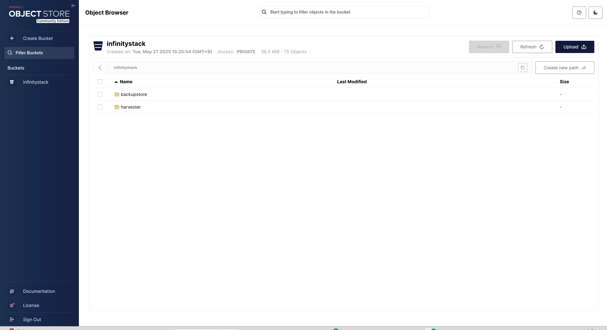
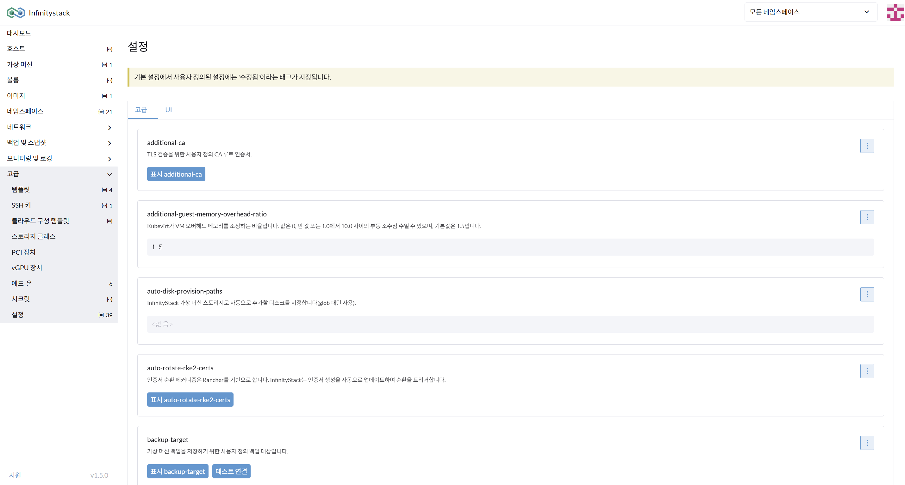
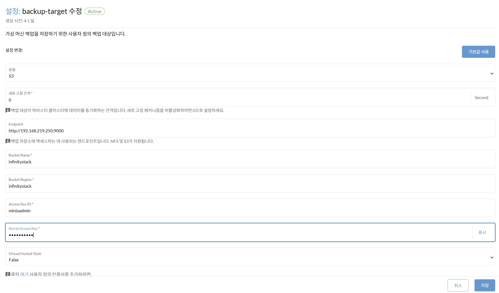
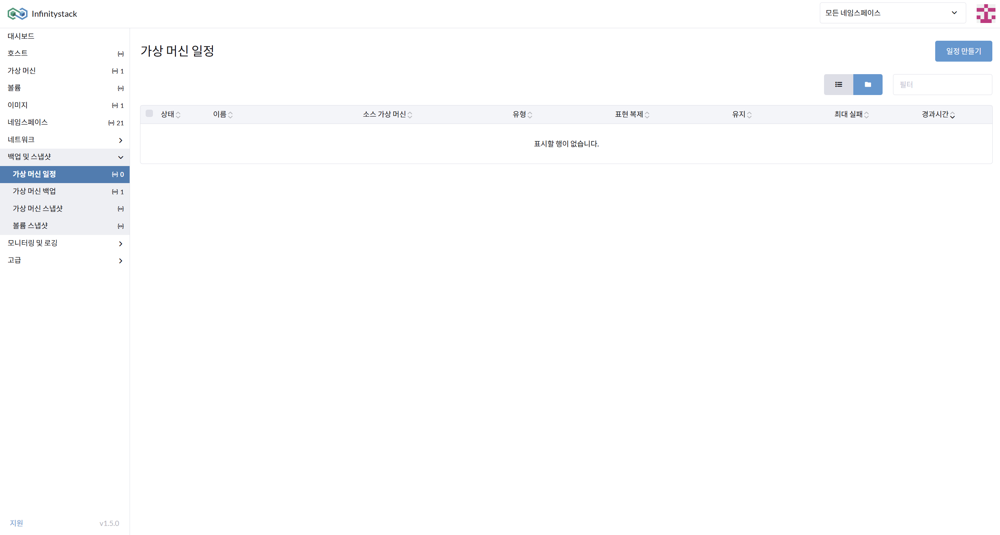
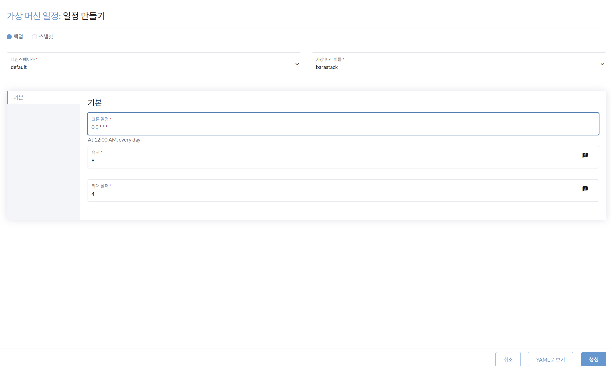
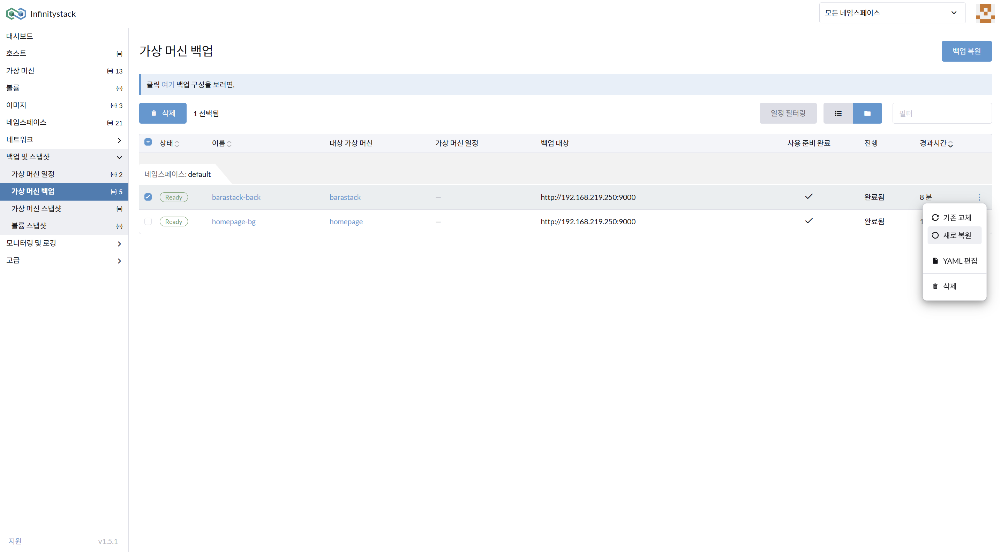
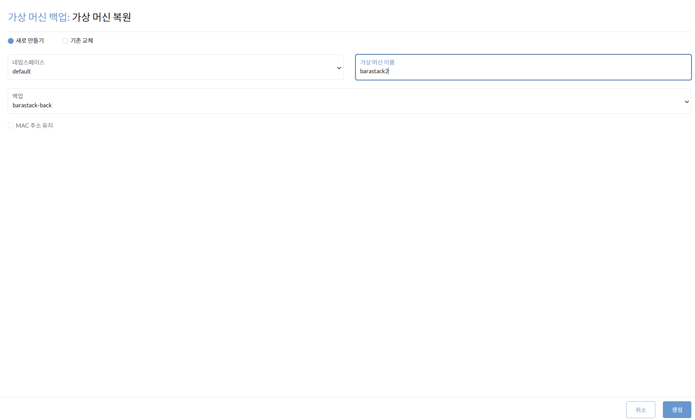

# 9. 백업 관리

> **가상 머신(VM)의 안정적인 백업**

---

## 개요

Infinitystack의 백업은 **NFS** 또는 **S3 (Object Storage)** 서버를 백업 대상으로 사용합니다. MinIO를 사용한 S3 호환 스토리지 구성을 예시로 설명합니다.

```
VM (barastack)
    │
    ▼ 백업
S3 / MinIO 백업 서버
    └── Bucket: infinitystack
```

---

## 사전 준비: MinIO 백업 서버 구축

**경로**: 백업 서버 사전 구축

### 화면



### MinIO 서버 실행

```bash
mkdir -p ~/minio-data
export MINIO_ROOT_USER=minioadmin
export MINIO_ROOT_PASSWORD=minioadmin

nohup minio server ~/minio-data \
  --address 0.0.0.0:9000 \
  --console-address 0.0.0.0:9001 \
  > ~/minio.log 2>&1 &
```

### MinIO 접속 및 Bucket 생성

| 항목 | 값 |
|------|-----|
| 백업 서버 콘솔 | `http://[백업서버IP]:9001` |
| API Endpoint | `http://[백업서버IP]:9000` |
| 로그인 ID (Access Key) | `minioadmin` |
| 비밀번호 (Secret Key) | `minioadmin` |
| Bucket 이름 | `infinitystack` |

---

## backup-target 설정

**경로**: 고급 > 설정 > backup-target

### 화면





### 절차

가상머신 백업을 저장하기 위한 **사용자 정의 백업 구성**입니다.

1. **유형 선택**: `S3` (Object Storage)
2. **Endpoint** 입력: 예시) `http://192.168.219.250:9000`
3. **Bucket Name / Region** 입력: `infinitystack / infinitystack`
4. **Access / Secret Key** 입력: `minioadmin / minioadmin`

---

## 백업 일정 생성

**경로**: 백업 및 스냅샷 > 가상머신일정

### 화면





### 절차

1. **일정 만들기**: 백업/스냅샷을 선택합니다.
2. **네임스페이스** 입력: `default`
3. **가상머신 이름** 입력: 예시) `barastack`
4. **기본 크론일정** 입력: 예시) `0 0 1 * *`

    !!! info "크론(Cron) 형식"
        일반적인 cron 포맷을 적용합니다.

        | 크론 표현식 | 의미 |
        |------------|------|
        | `0 0 1 * *` | 매월 1일 자정 |
        | `0 0 * * 0` | 매주 일요일 자정 |
        | `0 2 * * *` | 매일 오전 2시 |

---

## 백업 복원

**경로**: 백업 및 스냅샷 > 가상머신백업

### 화면





### 절차

1. 좌측 메뉴: **가상머신 > 백업받기**에서 수행한 결과가 성공적이면 여기서 가상머신의 백업을 조회할 수 있습니다.

2. **가상머신백업 복원 "새로 만들기"**를 선택합니다.

    !!! info "복원 방식"
        백업본으로 새로운 가상머신을 생성합니다.

3. **네임스페이스** 입력: `default`
4. **가상머신 이름** 입력: 예시) `barastack-2`
5. **백업 목록 선택**: `barastack-back`

---

!!! tip "백업 관리 권장사항"
    - 중요한 VM은 **일별 백업** + **주별 스냅샷** 조합을 권장합니다.
    - 백업 서버는 VM과 **다른 물리 호스트** 또는 **외부 위치**에 구성하세요.
    - 주기적으로 **백업 복원 테스트**를 수행하여 데이터 무결성을 검증하세요.

---

*Copyright 2025. BGROUND Co.,Ltd. All rights reserved. | [www.bground.ai](https://www.bground.ai)*
