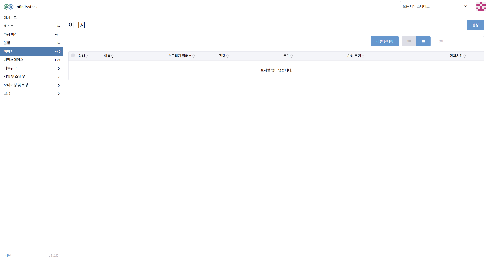
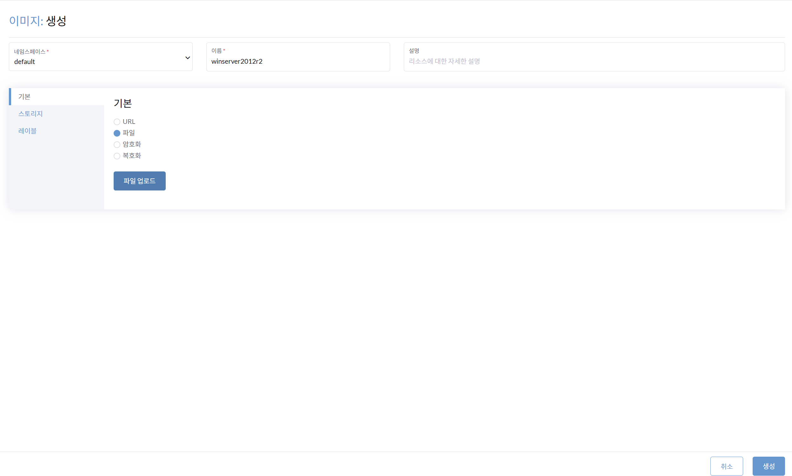

# ISO 이미지 등록

> 가상 머신(VM)의 OS 기반 이미지(Windows ISO)를 Infinitystack에 등록합니다.

---

## STEP 1. 이미지 생성 메뉴 접속

**경로:** 좌측 메뉴 → **이미지** → **생성** 버튼 클릭



---

## STEP 2. 기본 정보 입력

**경로:** 이미지 생성 → **기본** 탭



| 항목 | 입력값 |
|------|--------|
| **네임스페이스** | `default` |
| **이름** | `winserver2012r2` (예시) |
| **기본 정보 유형** | `파일` 선택 |

---

## STEP 3. ISO 파일 업로드

**파일 업로드** 버튼을 클릭하여 Windows ISO 파일을 선택합니다.

!!! info "Windows ISO 파일명 예시"
    ```
    Windows_Server_2012_r2_9600.17050.WINBLUE_REFRESH.140317-1640_X64FRE_SERVER_EVAL_EN-US-IR3_SSS_X64FREE_EN-US_DV9.ISO
    ```

---

## STEP 4. 생성 완료

**생성** 버튼을 클릭합니다.

!!! warning "주의사항"
    파일 업로드 중에는 페이지를 **새로고침하거나 닫으면 안됩니다.**
