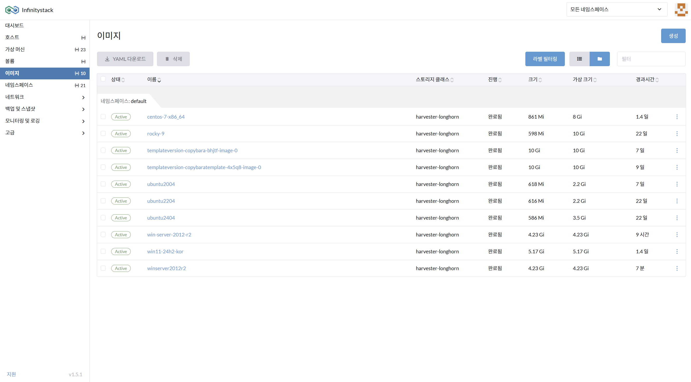
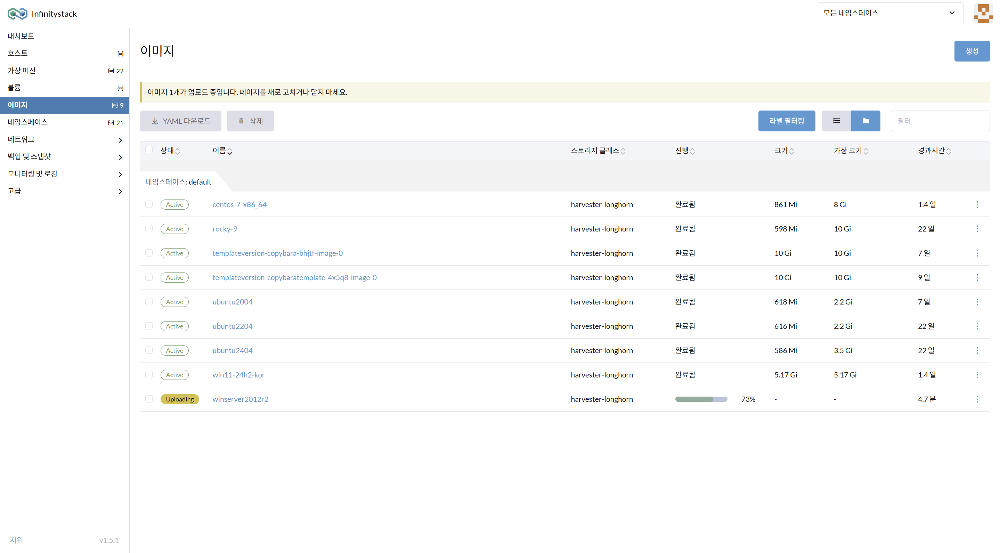

# 이미지 상태 점검

> 업로드된 Windows 이미지가 정상적으로 등록되었는지 확인합니다.

---

## STEP 1. 이미지 목록 확인

**경로:** 좌측 메뉴 → **이미지**

업로드 진행 중에는 **진행** 컬럼에 진척률이 표시됩니다.

---

## STEP 2. Active 상태 확인

업로드가 완료되면 상태가 `Active`로 변경됩니다.

| 항목 | 확인 내용 |
|------|----------|
| **상태** | `Active` (업로드 완료) |
| **스토리지 클래스** | `harvester-longhorn` |
| **크기** | 업로드된 ISO 파일 크기 |

!!! success "완료"
    상태가 `Active`로 표시되면 VM 생성 시 해당 이미지를 cdrom으로 사용할 수 있습니다.
