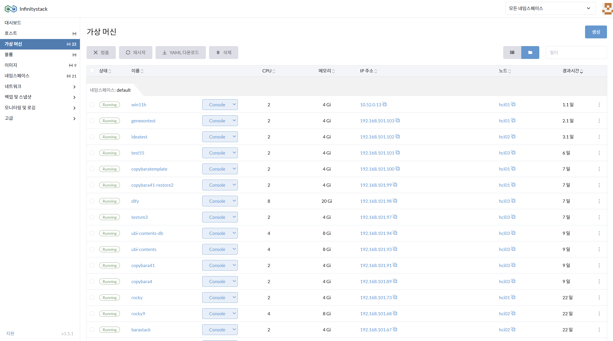
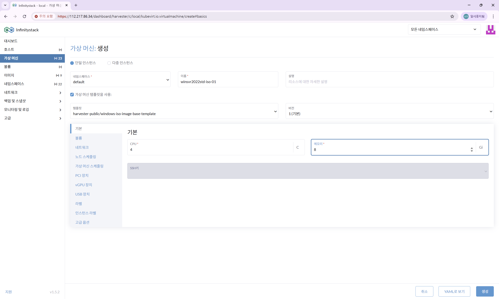

# 기본 정보 설정

> Windows 가상머신(VM)의 이름, CPU, 메모리, 템플릿을 설정합니다.

---

## STEP 1. VM 생성 메뉴 접속

**경로:** 좌측 메뉴 → **가상 머신** → **생성** 버튼 클릭

---

## STEP 2. 기본 정보 입력

**경로:** 가상 머신 생성 → **기본 정보** 탭

| 항목 | 입력값 |
|------|--------|
| **네임스페이스** | `default` |
| **VM 이름** | `winsvr2022std-iso-01` (예시) |
| **CPU** | `4` vCPU |
| **메모리** | `8` GB |

---

## STEP 3. 템플릿 선택

| 항목 | 입력값 |
|------|--------|
| **템플릿** | `harvester-public/windows-iso-image-base-template` |

!!! tip "템플릿 사용"
    Windows 전용 템플릿을 선택하면 cdrom, VirtIO 드라이버 등 필수 설정이 자동으로 적용됩니다.
