# Windows OS 설치

> VM Console에 접속하여 Windows OS를 단계별로 설치합니다.

---

## STEP 1. Console 접속

**경로:** 가상 머신 목록 → VM 선택 → **Console** 탭 → **Web VNC에서 열기**

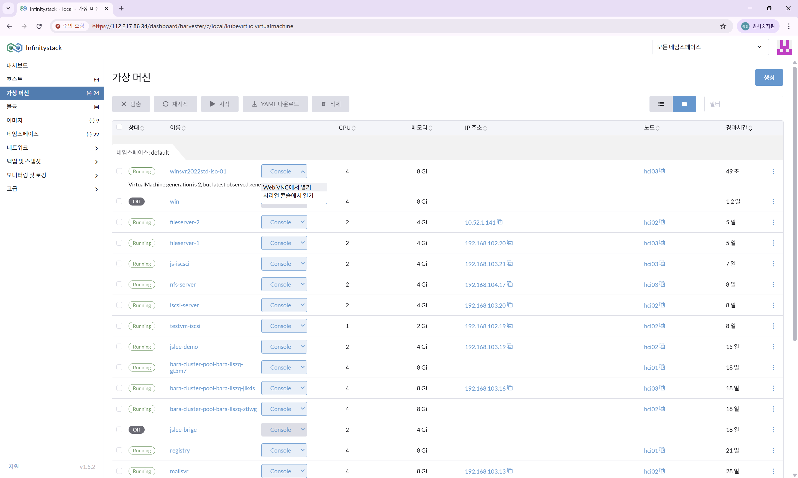

!!! note "부팅 확인"
    Windows는 **cdrom으로 부팅**한 후 추가 설치를 진행해야 합니다.

---

## STEP 2. 언어 및 시간 설정

| 항목 | 설정값 |
|------|--------|
| **언어** | `Korean (Korea)` |

**Next** 클릭

---

## STEP 3. 키보드 및 설치 시작

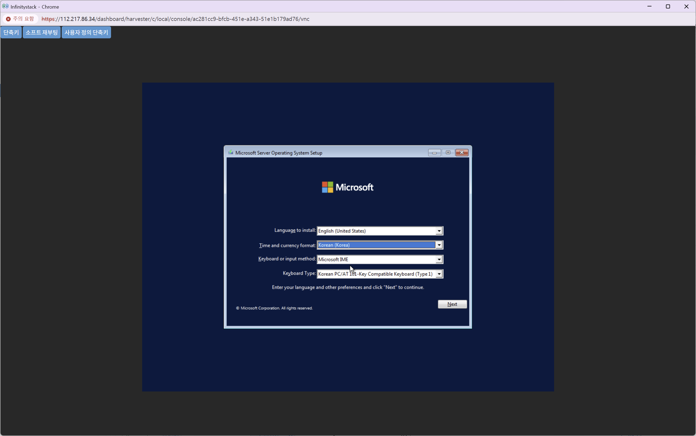

| 항목 | 설정값 |
|------|--------|
| **키보드** | `Microsoft IME` |

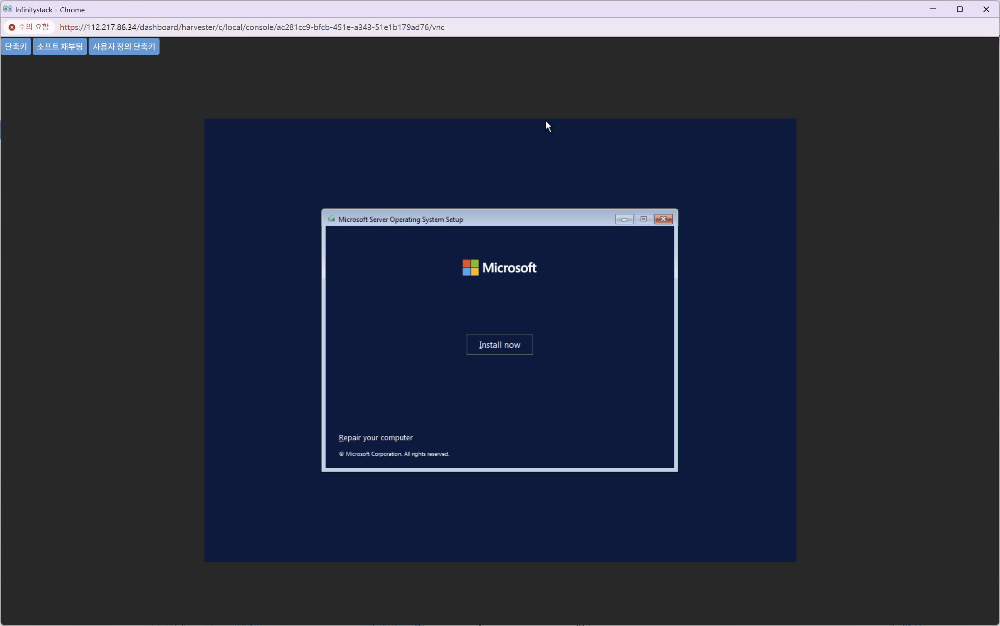

**Install now** 클릭

---

## STEP 4. OS 버전 선택

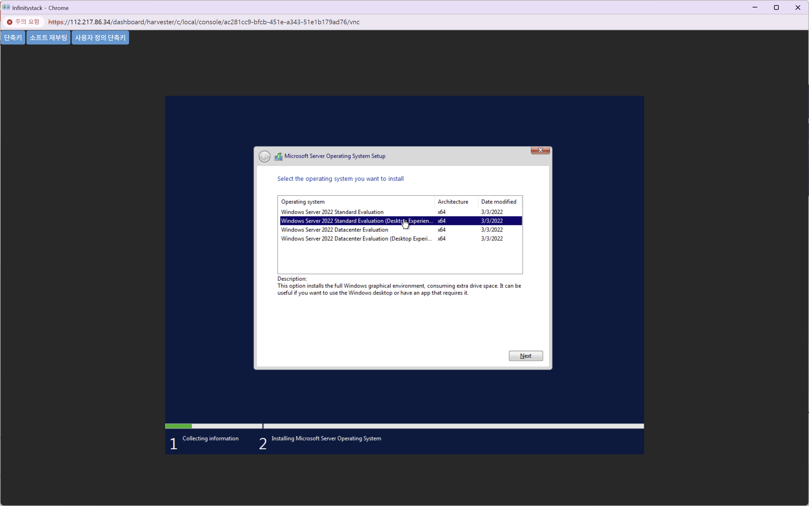

| 항목 | 설정값 |
|------|--------|
| **설치 OS** | `Windows Server 2022 Standard Evaluation (Desktop Experience)` |

라이선스 동의 체크 후 **Next** 클릭

---

## STEP 5. 설치 유형 선택

**경로:** 설치 유형 → `Custom: Install Microsoft Server Operating System only (advanced)` 선택

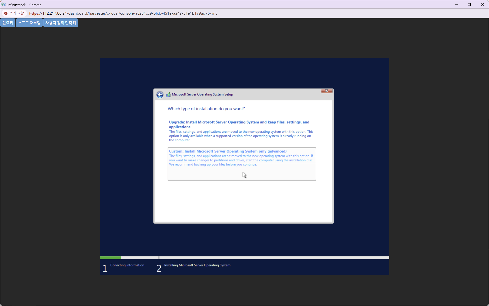

**Load driver** 클릭하여 VirtIO 드라이버를 로드합니다.

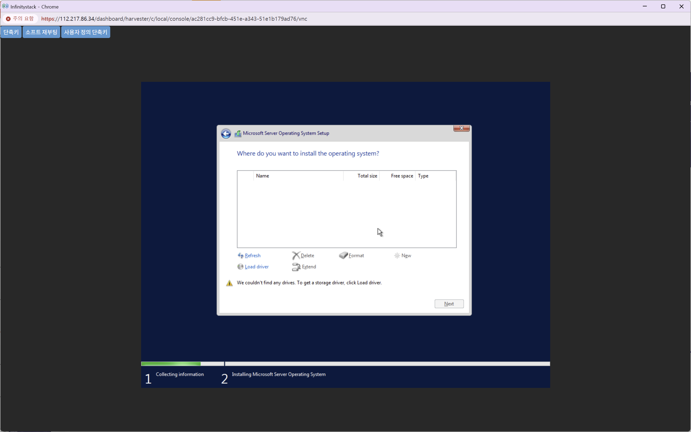

---

## STEP 6. 드라이버 폴더 선택

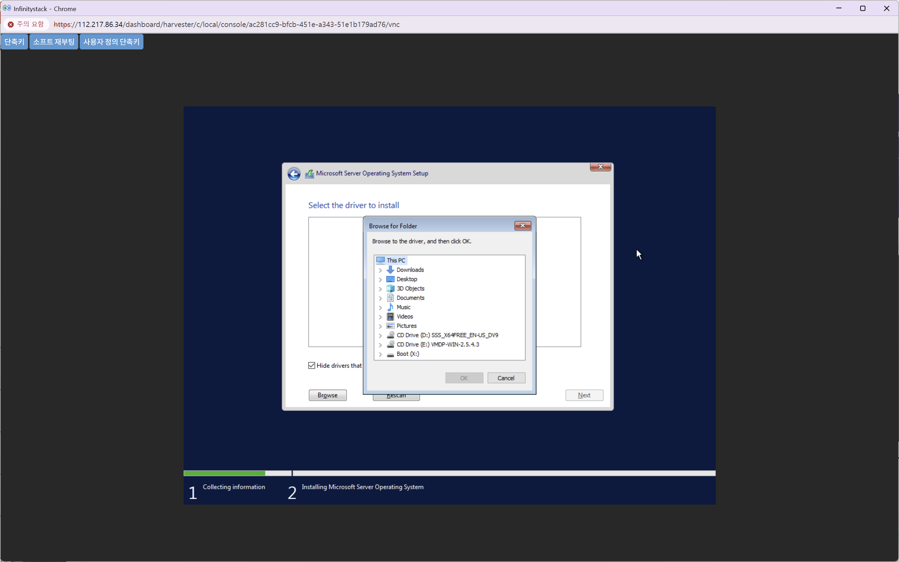

| 항목 | 값 |
|------|-----|
| **드라이브** | `CD Drive (E:) VMDP-WIN-2.5.4.3` |
| **폴더 경로** | `E:\win10-11-server22\x64\pvvx` |

**OK** 클릭

---

## STEP 7. 드라이버 선택 및 설치

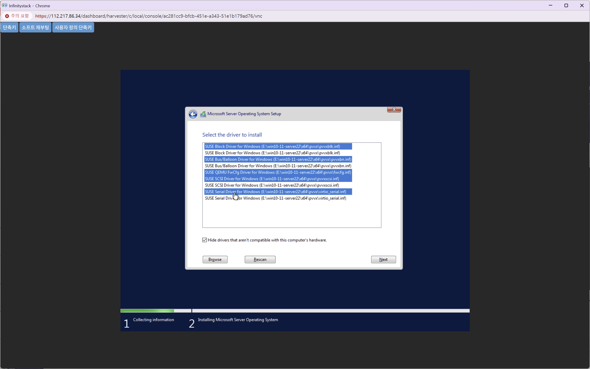

`SUSE Block Driver for Windows` 외 목록의 모든 드라이버를 **중복 없이 모두 선택**합니다.

!!! warning "주의사항"
    드라이버를 중복 선택하지 않도록 주의하세요.

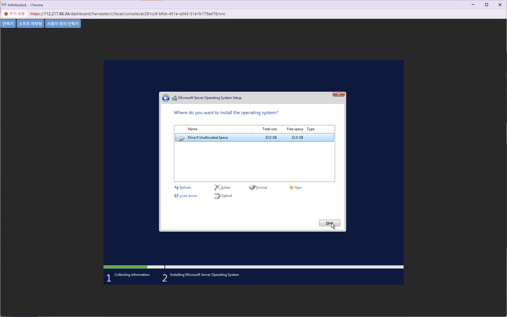

설치 위치: **Drive 0 Unallocated Space** 선택 → **Next** 클릭

---

## STEP 8. 설치 진행 및 암호 설정

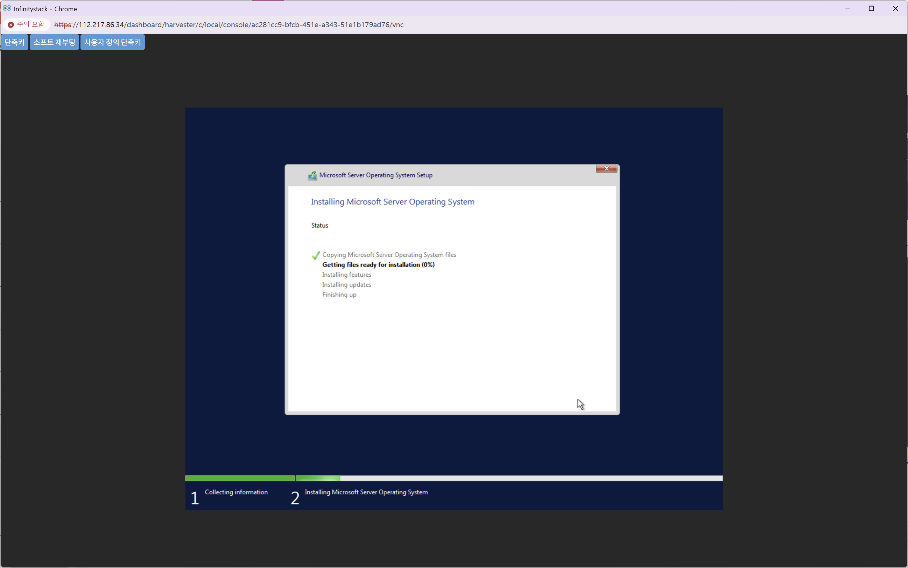

Windows 설치가 완료되면 관리자 암호를 설정합니다.

| 항목 | 설정값 |
|------|--------|
| **계정** | `Administrator` |
| **암호** | 복잡도 요건에 맞는 암호 입력 |
| **암호 확인** | 동일 암호 재입력 |

!!! warning "보안 주의"
    실제 운영 환경에서는 복잡한 암호를 반드시 설정하세요.

---

## STEP 9. 로그인 확인

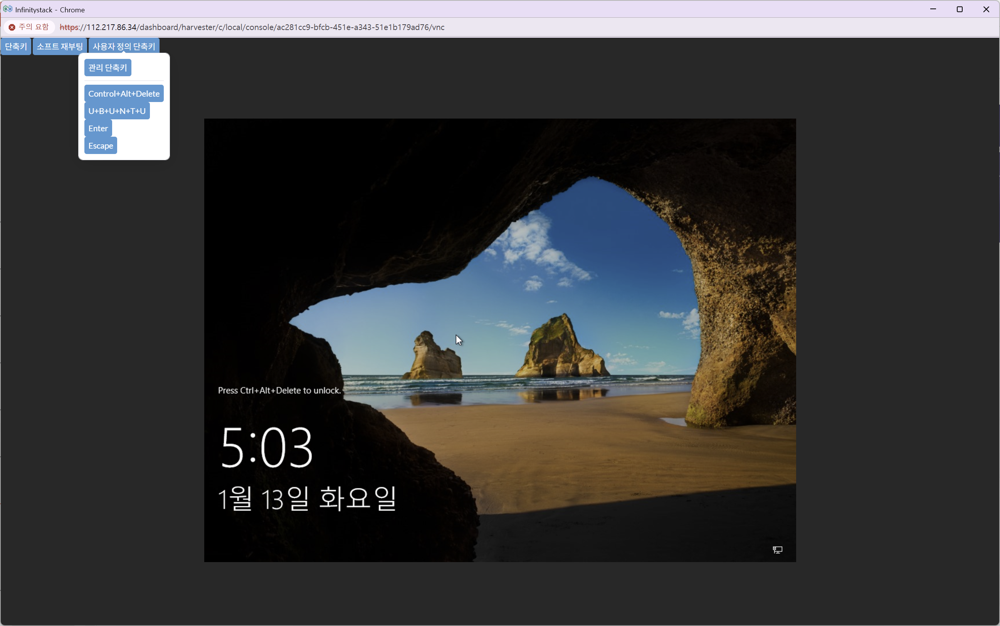

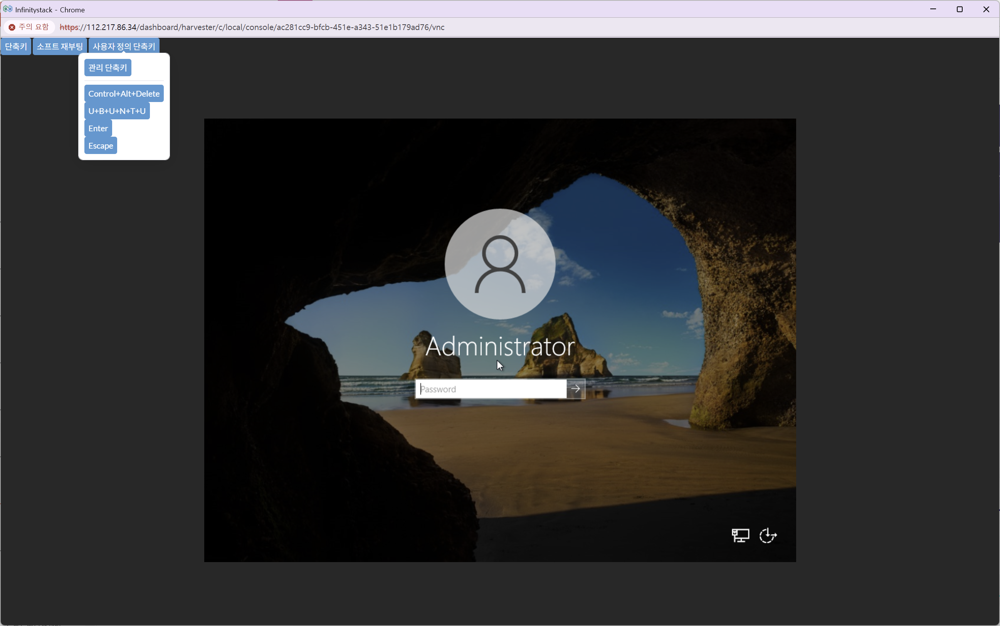

설치 완료 후 `Administrator` 계정으로 로그인하여 정상 설치를 확인합니다.

!!! success "완료"
    Windows 바탕화면이 표시되면 OS 설치가 완료된 것입니다.
