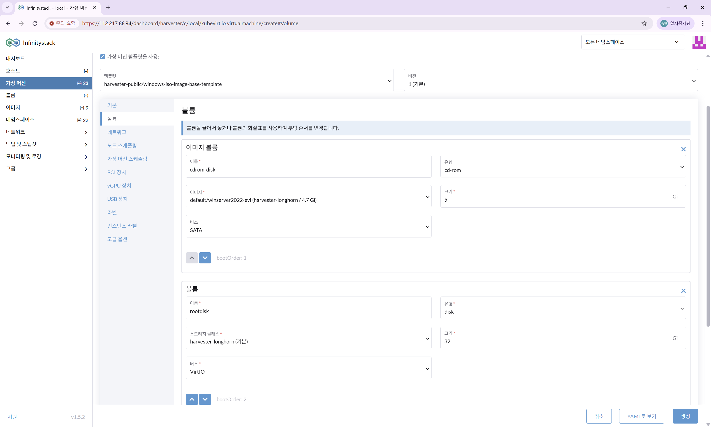
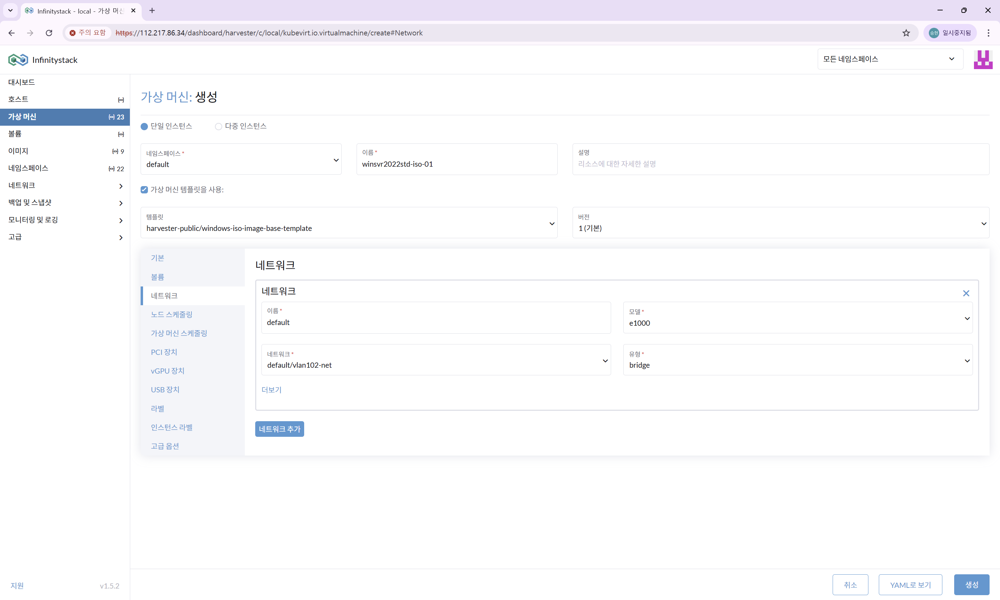

# 볼륨 및 네트워크 설정

> Windows VM의 스토리지(볼륨)와 네트워크를 구성합니다.

---

## STEP 1. 볼륨 설정

**경로:** 가상 머신 생성 → **볼륨** 탭

| 항목 | 입력값 |
|------|--------|
| **cdrom-disk 이미지** | `default/winserver2022-evl` |
| **rootdisk 스토리지 클래스** | `harvester-longhorn` |
| **rootdisk 크기** | `50` GB 이상 권장 |

!!! info "볼륨 크기 안내"
    Windows Server 운영을 위해 최소 **50GB 이상**의 rootdisk를 권장합니다.
    데이터 디스크는 별도 볼륨을 추가합니다.

---

## STEP 2. 네트워크 설정

**경로:** 가상 머신 생성 → **네트워크** 탭

| 항목 | 입력값 |
|------|--------|
| **네트워크 이름** | `default` |
| **네트워크 모델** | `e1000` |
| **네트워크 유형** | `bridge` |
| **네트워크 선택** | `default/vlan102-net` |

---

## STEP 3. 생성 완료

설정 확인 후 **생성** 버튼을 클릭합니다.
