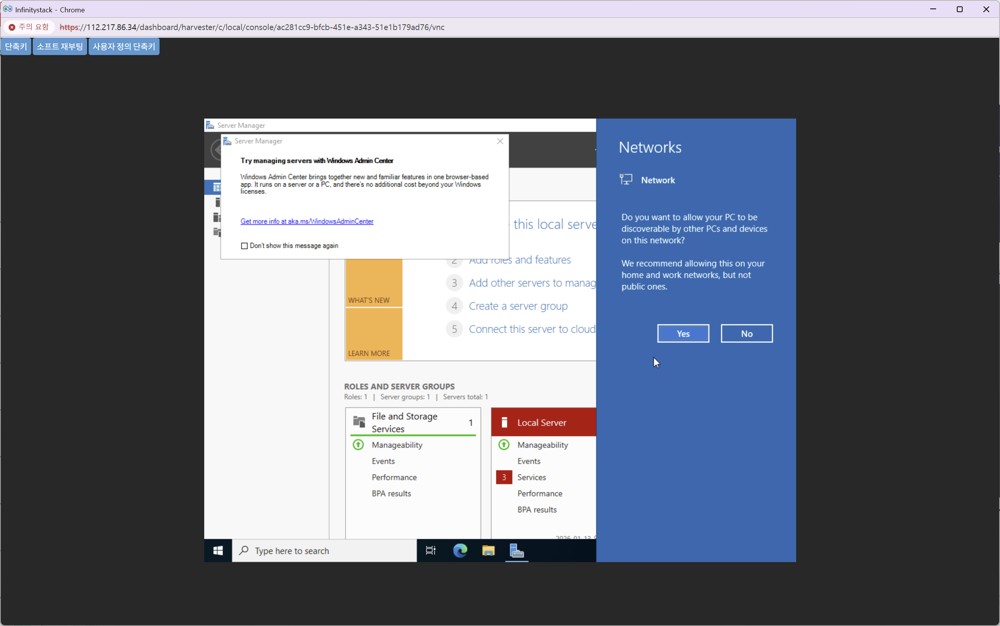
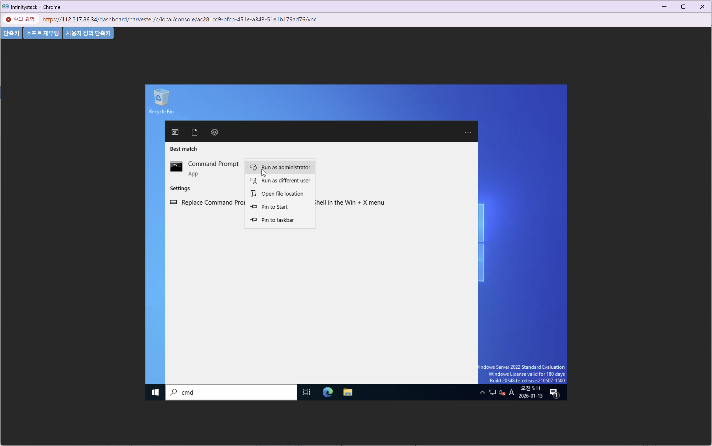
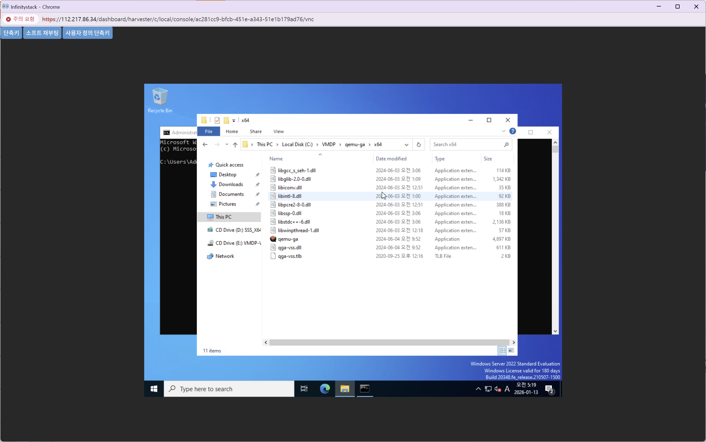
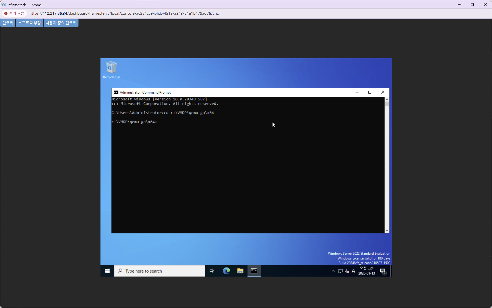

# qemu-ga 수동 설치

> QEMU Guest Agent를 수동으로 설치하여 VM 모니터링 및 제어 기능을 활성화합니다.

---

## STEP 1. 파일 복사

**경로:** Windows 탐색기 → CD Drive (E:) → qemu-ga 폴더 복사



| 항목 | 경로 |
|------|------|
| **원본 폴더** | `CD Drive (E:) VMDP-WIN-2.5.4.3\qemu-ga` |
| **복사 대상** | `C:\VMDP\qemu-ga` |

1. Network를 활성화합니다.
2. `CD Drive(E:)\qemu-ga` 폴더를 `C:\VMDP` 에 복사합니다.

---

## STEP 2. 폴더 병합





| 항목 | 경로 |
|------|------|
| **mingw64 폴더** | `C:\VMDP\qemu-ga\mingw64` |
| **x64 폴더** | `C:\VMDP\qemu-ga\x64` |

두 폴더의 파일을 `C:\VMDP\qemu-ga\x64` 로 **병합**합니다.

---

## STEP 3. 관리자 권한 명령 프롬프트 실행

Command Prompt를 **"Run as administrator"** (관리자 권한)으로 실행합니다.

---

## STEP 4. qemu-ga 서비스 설치



```cmd
cd C:\VMDP\qemu-ga\x64
qemu-ga -s install
```

!!! success "완료"
    위 명령 실행 후 **qemu-ga가 Windows 서비스로 등록**됩니다.
    서비스 관리자(`services.msc`)에서 `QEMU Guest Agent` 서비스를 확인할 수 있습니다.
