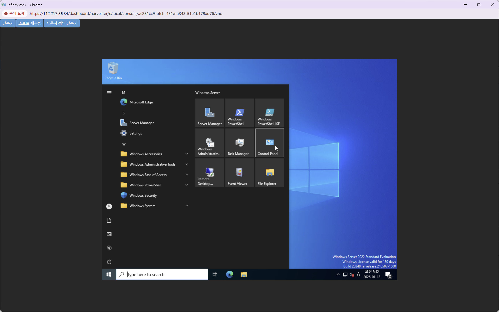
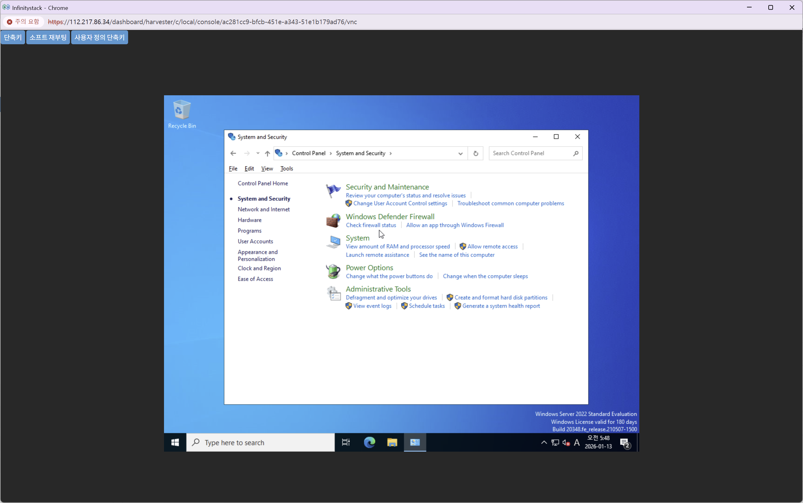
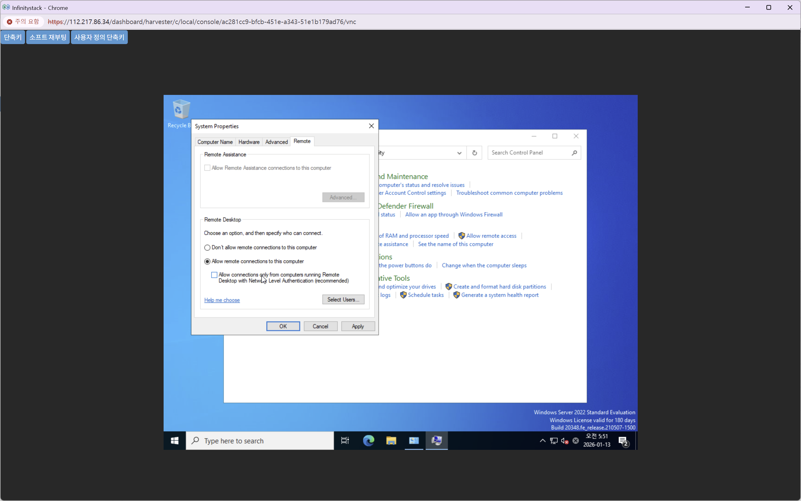
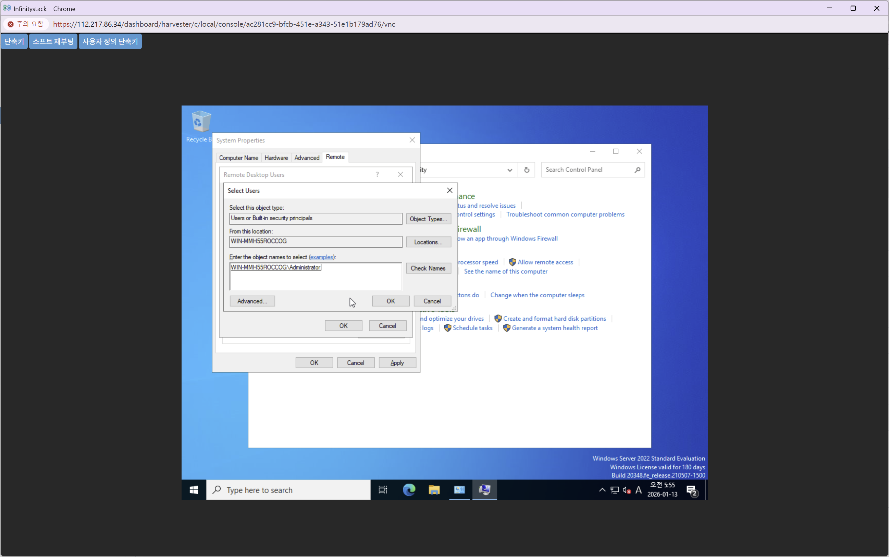
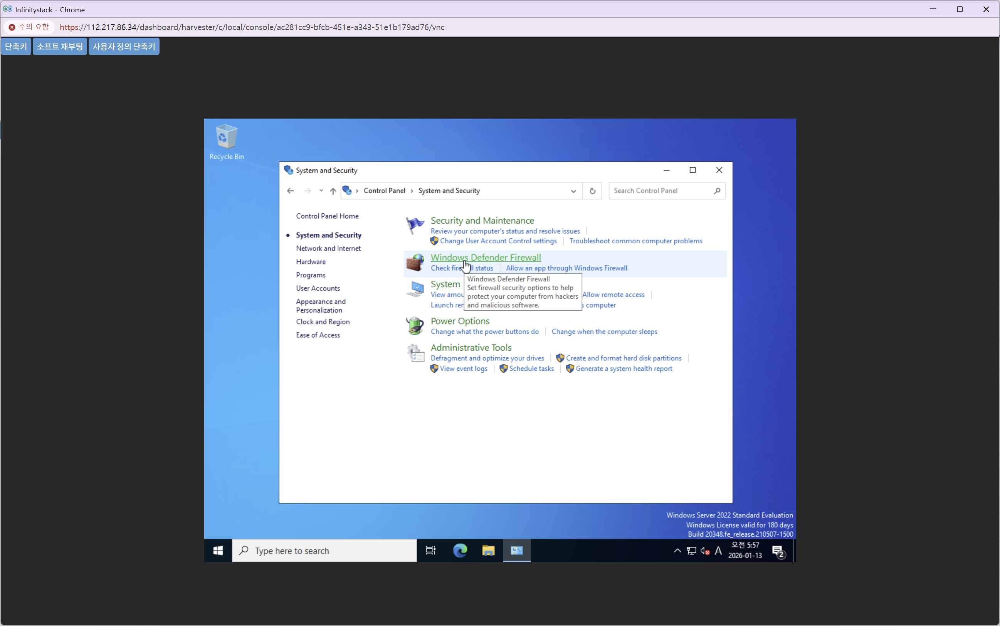
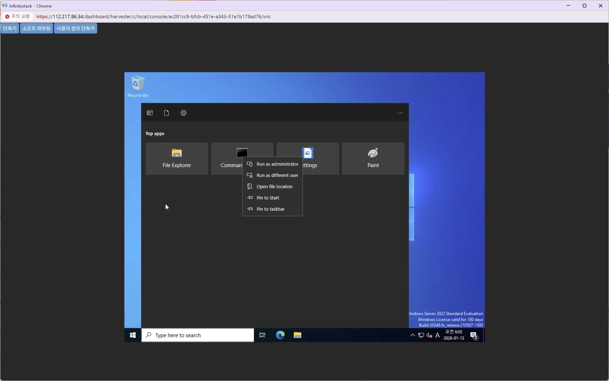
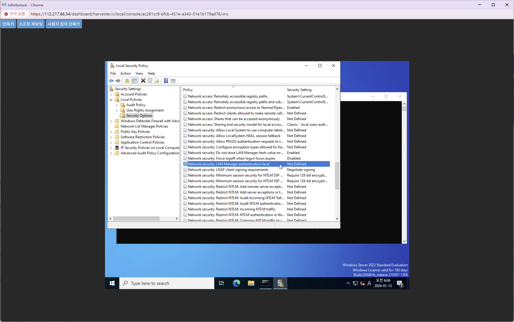
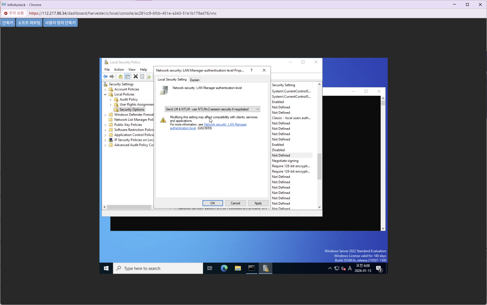

# 원격 접속 설정

> RDP(원격 데스크톱) 접속을 허용하고 방화벽 및 보안 정책을 설정합니다.

---

## STEP 1. 제어판 접속

**경로:** 시작 메뉴 → **Control Panel** → **System and Security**




---

## STEP 2. 원격 연결 허용

**경로:** System and Security → **Allow remote access**



| 항목 | 설정값 |
|------|--------|
| **원격 연결** | `Allow remote connections to this computer` 선택 |



**Apply** → **OK** 클릭

---

## STEP 3. 원격 접속 계정 추가

**Select Users** 버튼 클릭 → `Administrator` 계정 추가



---

## STEP 4. 방화벽 설정

**경로:** Control Panel → **Windows Defender Firewall**




=== "방화벽 비활성화"
    **Turn Windows Defender Firewall off** 선택 (테스트 환경)

=== "방화벽 유지 시 포트 오픈"
    **Advanced Settings** → Inbound Rules → **New Rule**

    | 항목 | 설정값 |
    |------|--------|
    | **규칙 유형** | `Port` |
    | **프로토콜** | `TCP` |
    | **포트** | `3389` |
    | **작업** | `Allow the connection` |

!!! tip "운영 환경 권장"
    운영 환경에서는 방화벽을 유지하고 **3389 포트만 오픈**합니다.

---

## STEP 5. 보안 정책 관리자 실행

관리자 권한 명령 프롬프트에서 실행합니다.



```cmd
secpol.msc
```

---

## STEP 6. LAN Manager 인증 수준 설정

**경로:** Local Policies → **Security Options**





| 항목 | 설정값 |
|------|--------|
| **정책** | `Network security: LAN Manager authentication level` |
| **설정값** | `Send LM & NTLM - use NTLMv2 session security if negotiated` |

**Apply** → **OK** 클릭

!!! success "완료"
    설정 완료 후 RDP 클라이언트(원격 데스크톱 연결)로 접속이 가능합니다.
