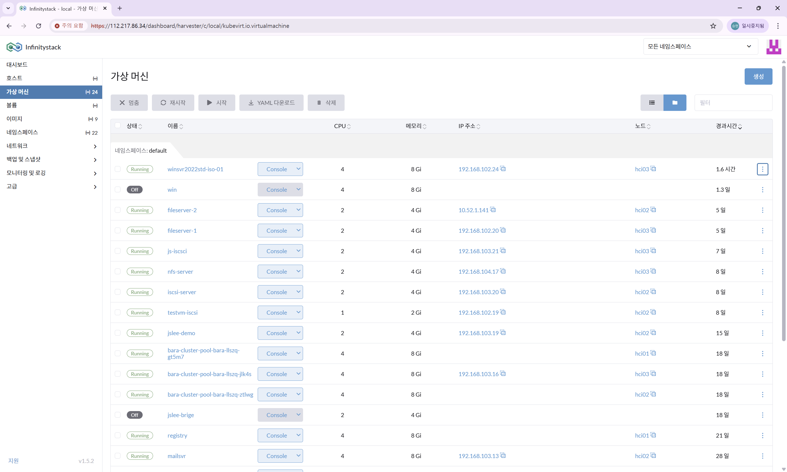

# VM 재시작

> 모든 설정 완료 후 Windows 가상머신을 재시작하여 변경 사항을 적용합니다.

---

## STEP 1. VM 재시작

**경로:** 가상 머신 목록 → VM 선택 → **재시작** 버튼

---

## STEP 2. IP 주소 확인

재시작 완료 후 VM 목록에서 IP 주소를 확인합니다.

| 항목 | 확인 내용 |
|------|----------|
| **상태** | `Running` |
| **IP 주소** | DHCP 서버에서 할당된 IP 확인 |

---

## STEP 3. RDP 접속 테스트

RDP 클라이언트(원격 데스크톱 연결)로 접속을 테스트합니다.

| 항목 | 설정값 |
|------|--------|
| **컴퓨터** | VM IP 주소 입력 |
| **사용자 이름** | `Administrator` |
| **암호** | 설치 시 설정한 암호 |

!!! success "ISO 기반 Windows VM 생성 완료"
    모든 절차가 완료되었습니다. RDP로 원격 접속하여 Windows Server를 정상적으로 사용할 수 있습니다.
