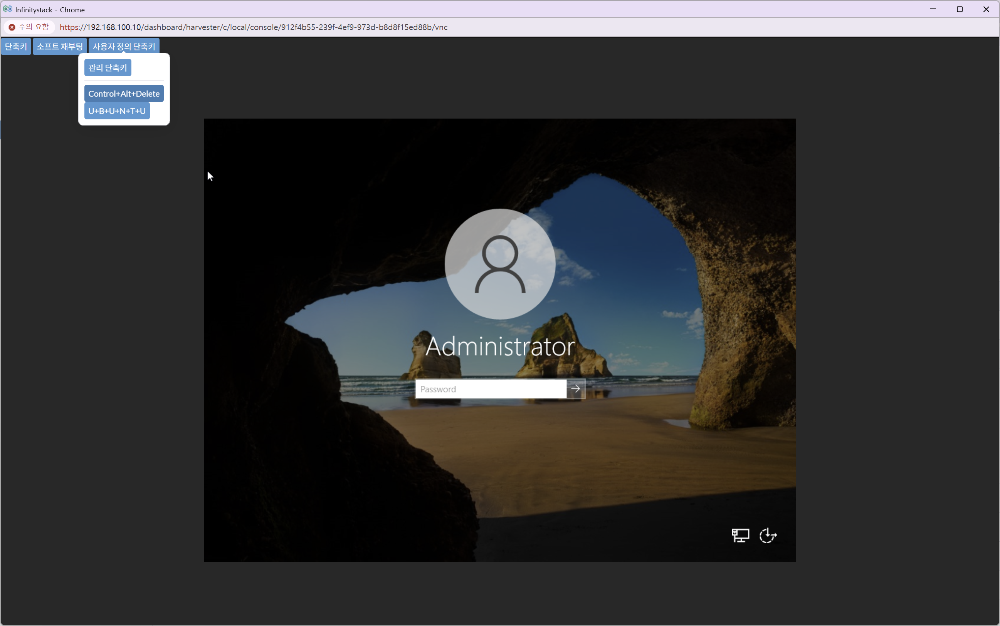
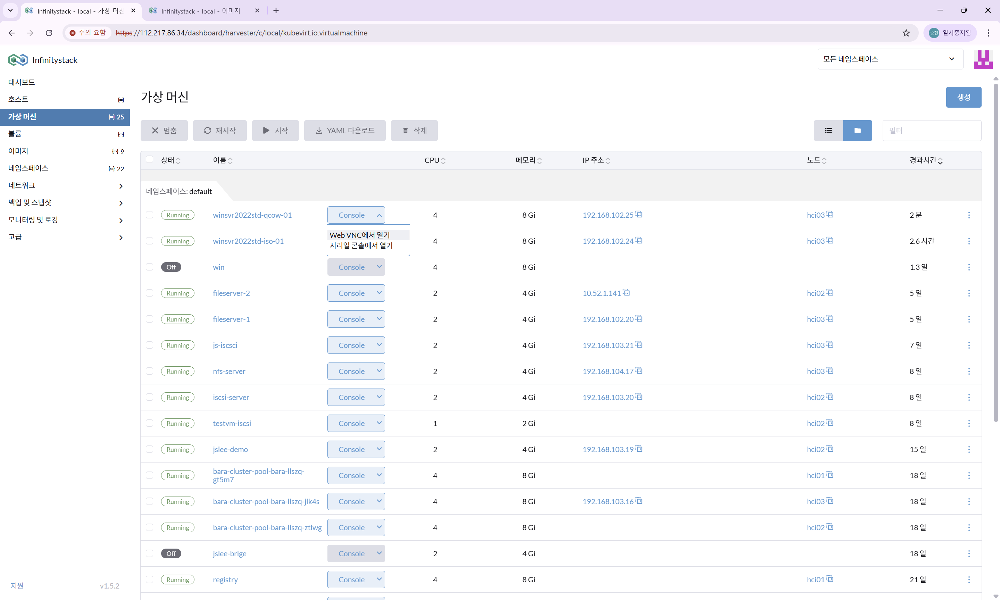

# Console 접속

> Web VNC를 통해 QCOW2 기반 Windows VM에 접속하고 Static IP를 설정합니다.

---

## STEP 1. Console 접속

**경로:** 가상 머신 목록 → VM 선택 → **Console** 탭 → **Web VNC에서 열기**

---

## STEP 2. 화면 잠금 해제 및 로그인

| 항목 | 방법 |
|------|------|
| **잠금 해제** | `Ctrl + Alt + Delete` |
| **계정** | `Administrator` |
| **암호** | 사전 설정된 암호 입력 |

---

## STEP 3. Static IP 설정

**경로:** 제어판 → 네트워크 및 인터넷 → 네트워크 연결 → 어댑터 속성 → **IPv4 속성**

| 항목 | 설정값 |
|------|--------|
| **IP 주소** | 할당된 Static IP 입력 |
| **서브넷 마스크** | 네트워크에 맞는 마스크 입력 |
| **기본 게이트웨이** | 게이트웨이 IP 입력 |
| **DNS 서버** | DNS IP 입력 |

!!! note "QCOW2 방식의 IP 설정"
    QCOW2 이미지는 **Static IP를 로그인 후 직접 설정**해야 합니다.

!!! success "QCOW2 기반 Windows VM 생성 완료"
    Static IP 설정이 완료되면 RDP로 원격 접속하여 Windows Server를 사용할 수 있습니다.
