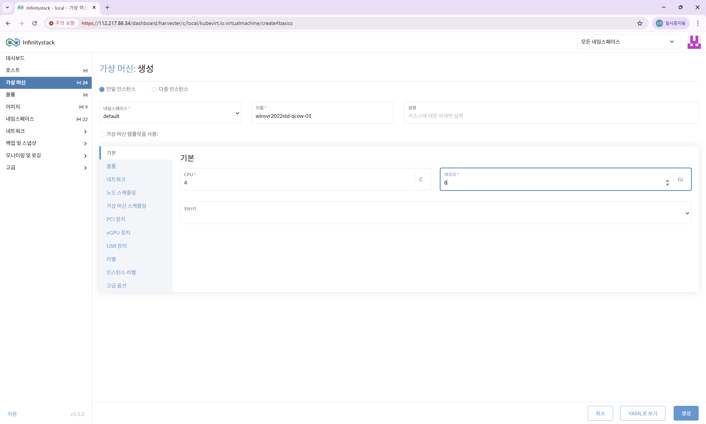
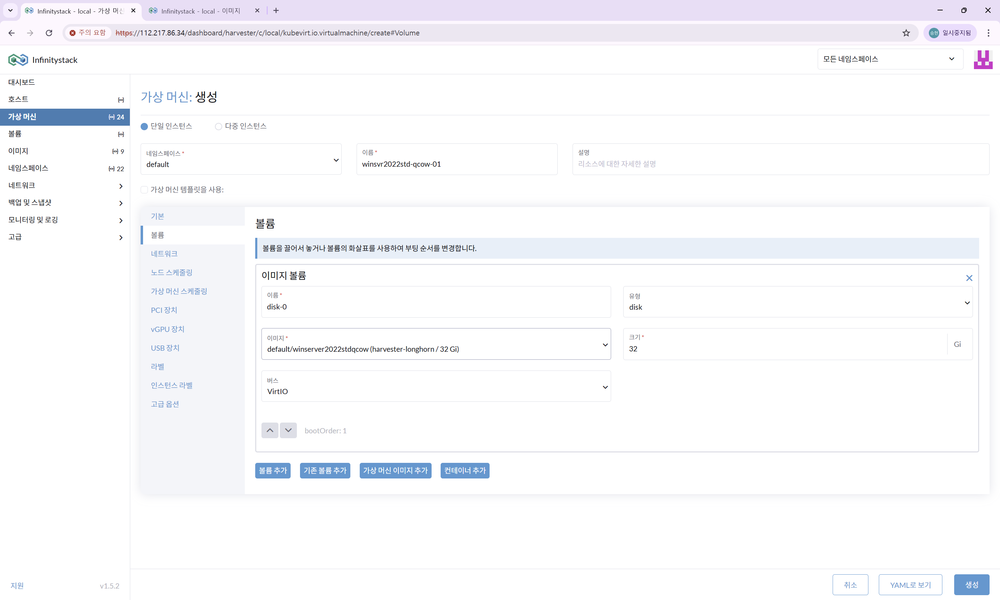
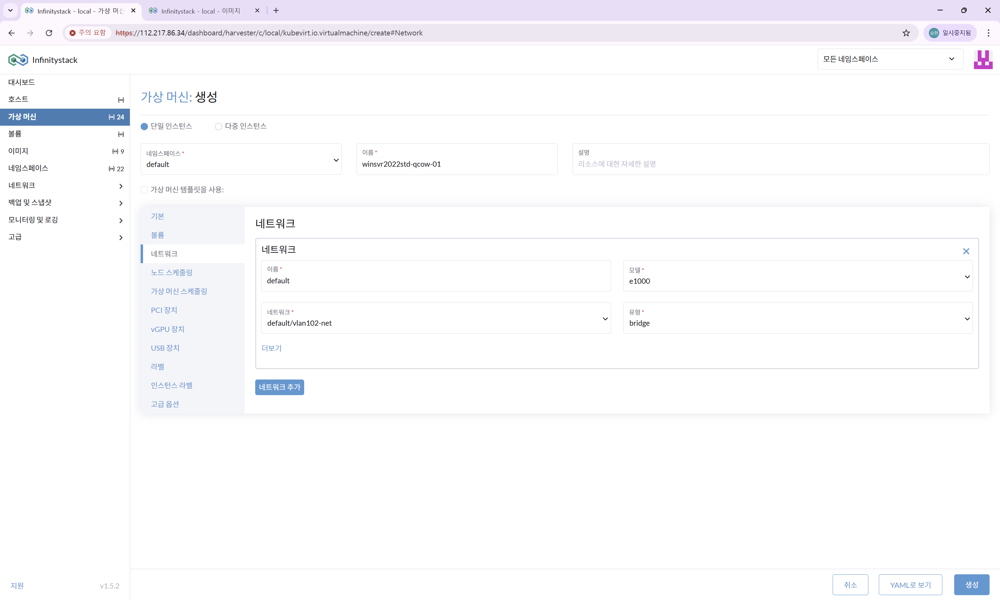

# QCOW 기반 VM 생성

> QCOW2 이미지를 사용하여 Windows 가상머신을 생성합니다.

---

## STEP 1. VM 생성 메뉴 접속

**경로:** 좌측 메뉴 → **가상 머신** → **생성** 버튼 클릭

---

## STEP 2. 기본 정보 입력

**경로:** 가상 머신 생성 → **기본 정보** 탭

| 항목 | 입력값 |
|------|--------|
| **네임스페이스** | `default` |
| **VM 이름** | `winserver2022-qcow-01` (예시) |
| **CPU** | `4` vCPU |
| **메모리** | `8` GB |

---

## STEP 3. 볼륨 설정

**경로:** 가상 머신 생성 → **볼륨** 탭

| 항목 | 설정값 |
|------|--------|
| **볼륨 이름** | `disk-0` |
| **유형** | `disk` |
| **이미지** | `default/winsvr2022stdqcow` 선택 |
| **스토리지 클래스** | `harvester-longhorn` |
| **크기** | `32` GB |

---

## STEP 4. 네트워크 설정

**경로:** 가상 머신 생성 → **네트워크** 탭

| 항목 | 설정값 |
|------|--------|
| **네트워크 이름** | `default` |
| **네트워크 모델** | `e1000` |
| **네트워크 유형** | `bridge` |
| **네트워크 선택** | `default/vlan102-net` |

!!! success "Live 마이그레이션 지원"
    Vlan 네트워크 모드이므로 **Live 마이그레이션**을 지원합니다.

---

## STEP 5. 생성 완료 확인

설정 확인 후 **생성** 버튼을 클릭합니다.

| 항목 | 확인 내용 |
|------|----------|
| **상태** | `Running` |
| **접속** | Console 버튼으로 Web VNC 접속 |
