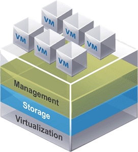

# QCOW 기반 VM 생성 — 개요

> 사전 설치된 QCOW2 이미지를 사용하여 Windows 가상머신을 빠르게 생성합니다.

---

## ISO 방식 vs QCOW2 방식 비교

---

| 항목 | ISO 방식 | QCOW2 방식 |
|------|:--------:|:----------:|
| OS 설치 필요 | ✅ 직접 설치 | ❌ 불필요 |
| 생성 속도 | 느림 | 빠름 |
| Live 마이그레이션 | ❌ | ✅ Vlan 모드 지원 |
| IP 설정 | DHCP 자동 | Static IP 직접 설정 |

---

## 생성 절차 요약

| 단계 | 페이지 |
|------|--------|
| **STEP 1** | [VM 생성](qcow_vm_create.md) — 기본 정보, 볼륨, 네트워크 설정 |
| **STEP 2** | [Console 접속](qcow_vm_console.md) — Web VNC 접속 및 Static IP 설정 |

!!! tip "QCOW2 방식 장점"
    OS 설치 과정 없이 즉시 VM을 사용할 수 있으며, Vlan 네트워크를 통해 **Live 마이그레이션**을 지원합니다.
