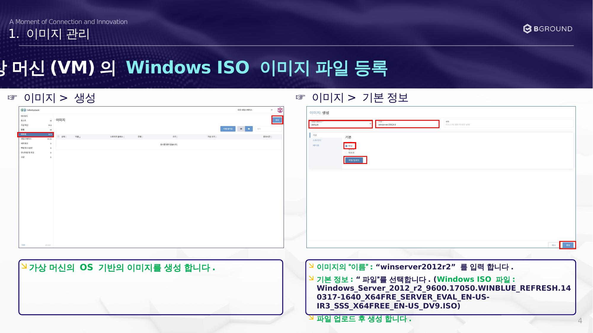

# ISO 이미지 등록

가상 머신의 OS 기반 이미지를 생성합니다.



## 절차

### ☞ 이미지 > 생성

1. 가상 머신의 OS 기반의 이미지를 생성합니다.
2. 이미지의 **"이름"**: `winserver2012r2` 를 입력합니다.

### ☞ 이미지 > 기본 정보

3. 기본 정보: **"파일"** 을 선택합니다.

    !!! info "Windows ISO 파일명 예시"
        ```
        Windows_Server_2012_r2_9600.17050.WINBLUE_REFRESH.140317-1640_X64FRE_SERVER_EVAL_EN-US-IR3_SSS_X64FREE_EN-US_DV9.ISO
        ```

4. 파일 업로드 후 **생성** 합니다.
