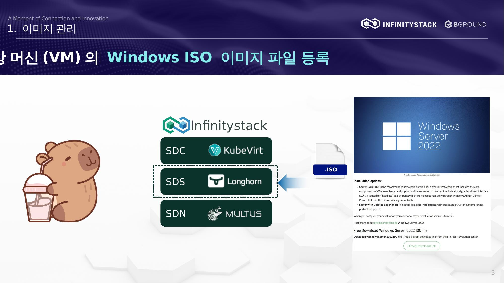

# 1. 이미지 관리 — 개요

가상 머신(VM)의 Windows ISO 이미지 파일을 등록하고 관리하는 방법을 설명합니다.

## 주요 구성 요소

| 구분 | 설명 |
|------|------|
| **SDC** | Software Defined Compute |
| **SDS** | Software Defined Storage |
| **SDN** | Software Defined Network |
| **.ISO** | Windows 설치 이미지 파일 |

## 절차 요약

1. [ISO 이미지 등록](iso-registration.md) — 이미지 생성 및 파일 업로드
2. [이미지 상태 점검](status-check.md) — 업로드 완료 후 상태 확인
