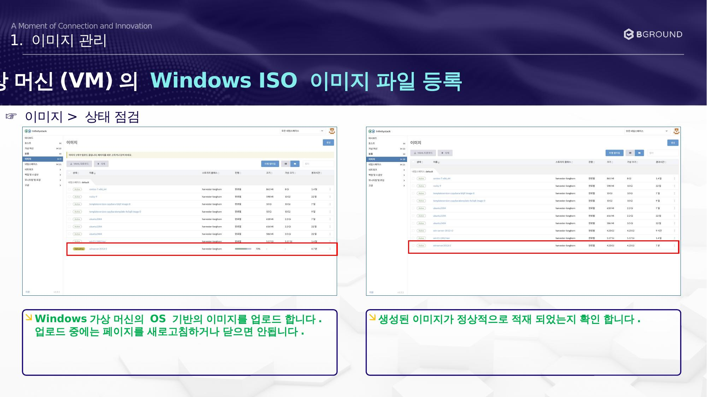

# 이미지 상태 점검

Windows 가상 머신의 OS 기반 이미지를 업로드하고 상태를 확인합니다.

## 절차

### ☞ 이미지 > 상태 점검

!!! warning "주의사항"
    업로드 중에는 페이지를 **새로고침하거나 닫으면 안됩니다.**

1. Windows 가상 머신의 OS 기반 이미지를 업로드합니다.
2. 생성된 이미지가 정상적으로 적재 되었는지 확인합니다.
