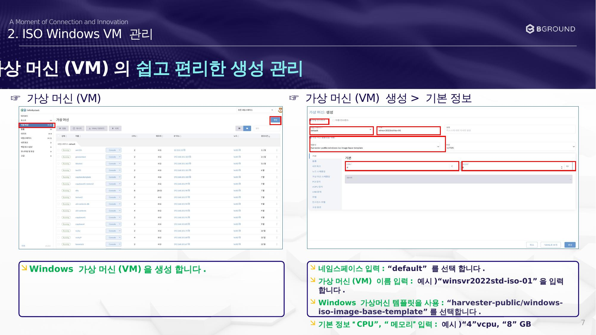

# VM 기본 정보 설정

Windows 가상 머신(VM)을 생성합니다.

## 절차

### ☞ 가상 머신(VM) 생성 > 기본 정보

| 항목 | 입력값 |
|------|--------|
| 네임스페이스 | `default` |
| VM 이름 | 예시: `winsvr2022std-iso-01` |
| 템플릿 | `harvester-public/windows-iso-image-base-template` |
| CPU | 예시: `4` vCPU |
| 메모리 | 예시: `8` GB |

1. Windows 가상 머신(VM)을 생성합니다.
2. 네임스페이스 입력: **"default"** 를 선택합니다.
3. 가상 머신(VM) 이름 입력: 예시) `winsvr2022std-iso-01` 을 입력합니다.
4. Windows 가상머신 템플릿을 사용: `harvester-public/windows-iso-image-base-template` 를 선택합니다.
5. 기본 정보 **"CPU"**, **"메모리"** 입력: 예시) `4` vCPU, `8` GB
