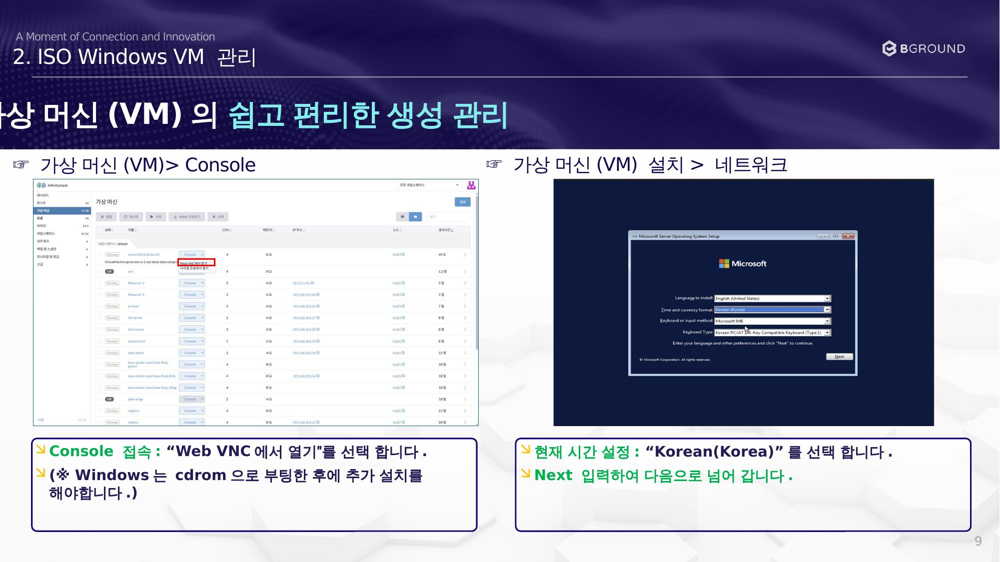
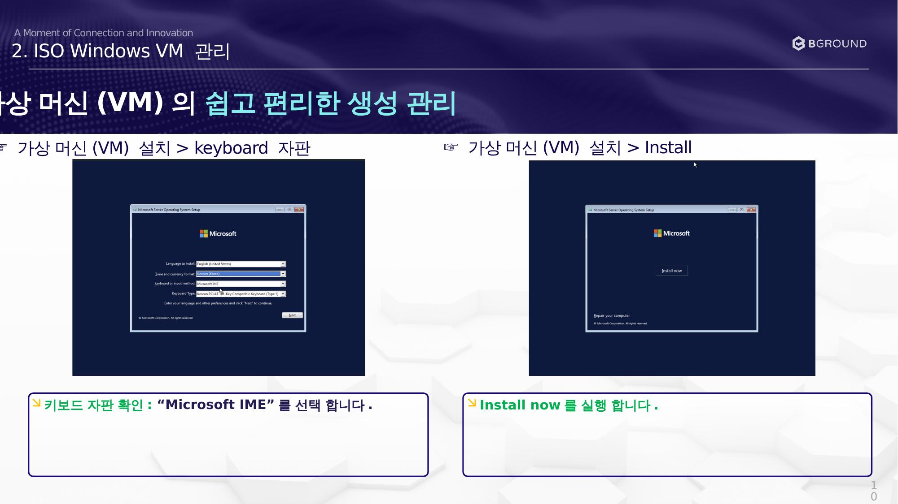
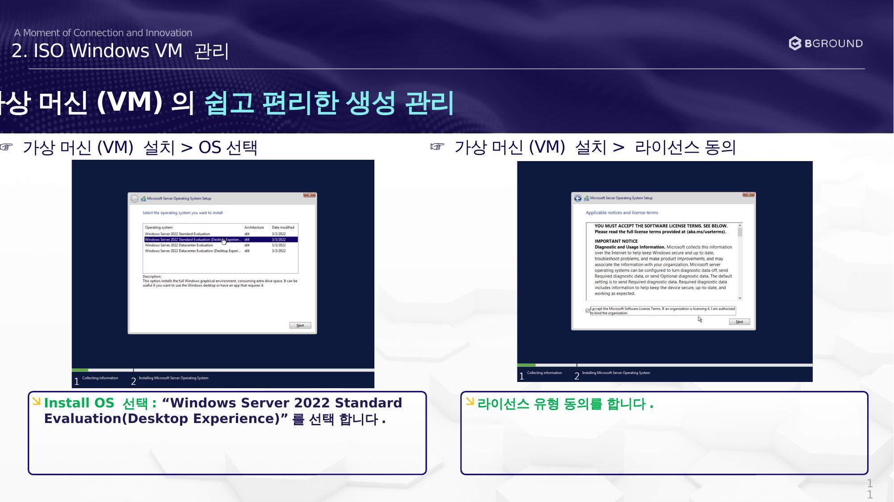
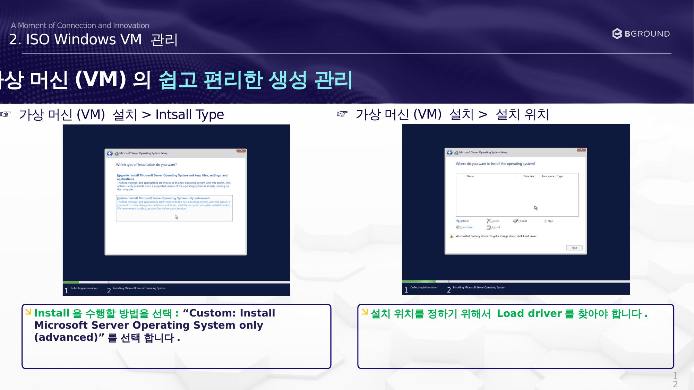
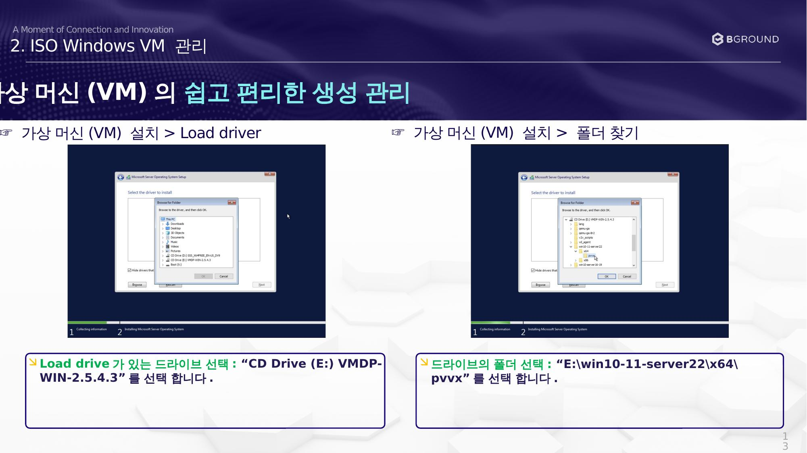
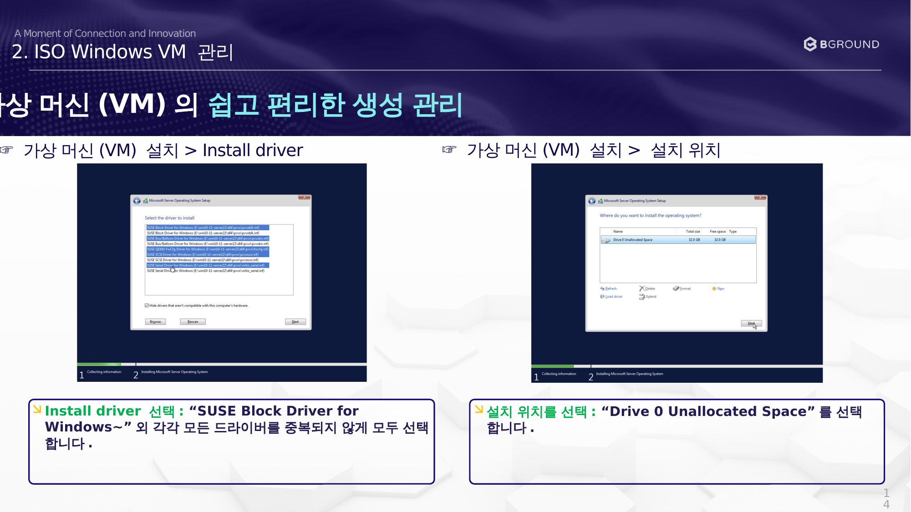
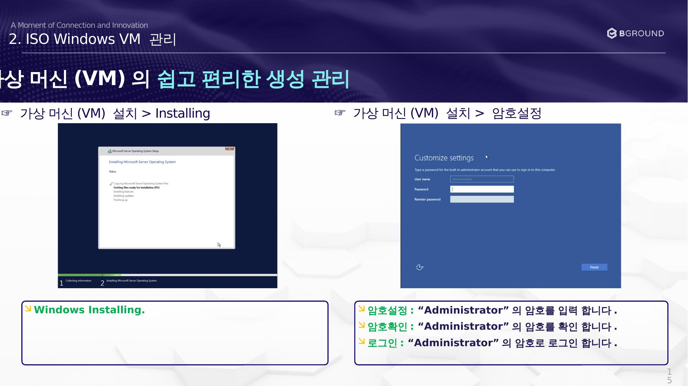
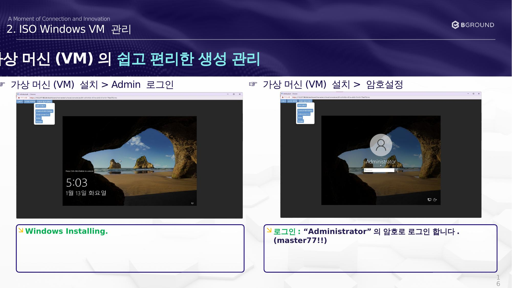

# Windows 설치

Console에 접속하여 Windows OS를 설치합니다.

## Console 접속 및 언어 설정

### ☞ 가상 머신(VM) 설치 > Console

!!! note
    Windows는 **cdrom으로 부팅한 후** 추가 설치를 해야합니다.

1. Console 접속: **"Web VNC에서 열기"** 를 선택합니다.
2. 현재 시간 설정: **"Korean(Korea)"** 를 선택합니다.
3. **Next** 입력하여 다음으로 넘어갑니다.

---

## 키보드 및 설치 시작

### ☞ 가상 머신(VM) 설치 > keyboard 자판

1. 키보드 자판 확인: **"Microsoft IME"** 를 선택합니다.
2. **Install now** 를 실행합니다.

---

## OS 선택 및 라이선스 동의

### ☞ 가상 머신(VM) 설치 > OS 선택

1. Install OS 선택: **"Windows Server 2022 Standard Evaluation (Desktop Experience)"** 를 선택합니다.
2. 라이선스 유형 동의를 합니다.

---

## 설치 유형 및 위치 선택

### ☞ 가상 머신(VM) 설치 > Install Type

1. Install을 수행할 방법을 선택: **"Custom: Install Microsoft Server Operating System only (advanced)"** 를 선택합니다.
2. 설치 위치를 정하기 위해서 **Load driver** 를 찾아야 합니다.

---

## 드라이버 폴더 선택

### ☞ 가상 머신(VM) 설치 > 폴더 찾기

| 항목 | 값 |
|------|-----|
| 드라이브 | `CD Drive (E:) VMDP-WIN-2.5.4.3` |
| 폴더 경로 | `E:\win10-11-server22\x64\pvvx` |

---

## 드라이버 설치 및 설치 위치

### ☞ 가상 머신(VM) 설치 > Install driver

1. Install driver 선택: **"SUSE Block Driver for Windows~"** 외 각각 모든 드라이버를 **중복되지 않게 모두 선택**합니다.
2. 설치 위치를 선택: **"Drive 0 Unallocated Space"** 를 선택합니다.

---

## Windows 설치 진행 및 암호 설정

### ☞ 가상 머신(VM) 설치 > 암호 설정

1. Windows Installing 진행을 기다립니다.
2. 암호 설정: **"Administrator"** 의 암호를 입력합니다.
3. 암호 확인: **"Administrator"** 의 암호를 확인합니다.
4. 로그인: **"Administrator"** 의 암호로 로그인합니다.

---

## Administrator 로그인

### ☞ 가상 머신(VM) 설치 > Admin 로그인

1. Windows 설치 완료 후 로그인합니다.
2. 로그인: **"Administrator"** 의 암호로 로그인합니다.

!!! warning "보안 주의"
    실제 운영 환경에서는 기본 예시 암호를 반드시 변경하세요.
