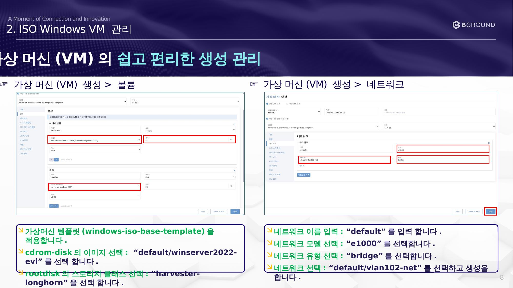

# 네트워크 및 볼륨 설정

가상머신 템플릿 적용 후 볼륨 및 네트워크를 설정합니다.

## 절차

### ☞ 가상 머신(VM) 생성 > 볼륨

가상머신 템플릿(`windows-iso-base-template`)을 적용합니다.

| 항목 | 설정값 |
|------|--------|
| cdrom-disk 이미지 | `default/winserver2022-evl` |
| rootdisk 스토리지 클래스 | `harvester-longhorn` |

### ☞ 가상 머신(VM) 생성 > 네트워크

| 항목 | 설정값 |
|------|--------|
| 네트워크 이름 | `default` |
| 네트워크 모델 | `e1000` |
| 네트워크 유형 | `bridge` |
| 네트워크 선택 | `default/vlan102-net` |

설정 완료 후 **생성** 버튼을 클릭합니다.
