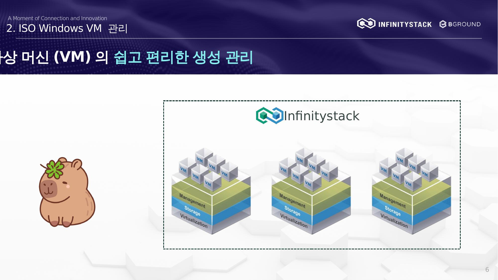

# 2. ISO Windows VM 관리 — 개요

가상 머신(VM)의 쉽고 편리한 생성 및 관리 방법을 설명합니다.

## 절차 요약

| 단계 | 내용 |
|------|------|
| [1. VM 기본 정보 설정](basic-info.md) | 이름, CPU, 메모리, 템플릿 설정 |
| [2. 네트워크 및 볼륨 설정](network-volume.md) | 스토리지 클래스, 네트워크 설정 |
| [3. Windows 설치](installation.md) | Console 접속 후 OS 설치 |
| [4. qemu-ga 수동 설치](qemu-ga.md) | QEMU Guest Agent 설치 |
| [5. 원격 접속 설정](remote-access.md) | RDP 및 방화벽 설정 |
| [6. VM 재시작](restart.md) | 설치 완료 후 재시작 및 IP 확인 |
