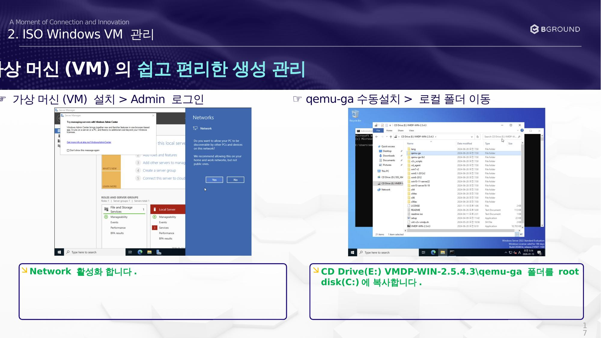
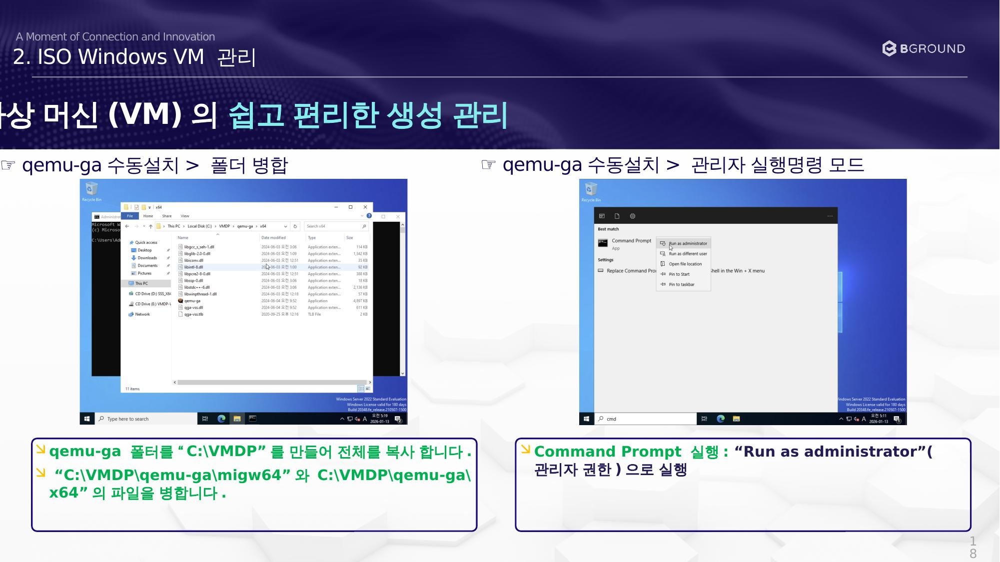
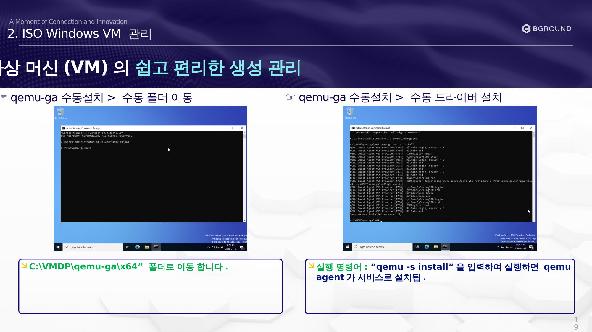

# qemu-ga 수동 설치

QEMU Guest Agent를 수동으로 설치합니다.

## 네트워크 활성화 및 파일 복사



### ☞ qemu-ga 수동 설치 > 로컬 폴더 이동

1. Network를 활성화합니다.
2. `CD Drive(E:) VMDP-WIN-2.5.4.3\qemu-ga` 폴더를 root disk(`C:`)에 복사합니다.

---

## 폴더 병합 및 관리자 실행



### ☞ qemu-ga 수동 설치 > 폴더 병합

1. qemu-ga 폴더를 `C:\VMDP` 를 만들어 전체를 복사합니다.
2. `C:\VMDP\qemu-ga\migw64` 와 `C:\VMDP\qemu-ga\x64` 의 파일을 병합합니다.
3. Command Prompt 실행: **"Run as administrator"** (관리자 권한)으로 실행합니다.

---

## qemu-ga 설치 명령 실행



### ☞ qemu-ga 수동 설치 > 수동 드라이버 설치

1. `C:\VMDP\qemu-ga\x64` 폴더로 이동합니다.
2. 아래 명령어를 실행하면 **qemu agent가 서비스로 설치**됩니다:

    ```cmd
    qemu-ga -s install
    ```
