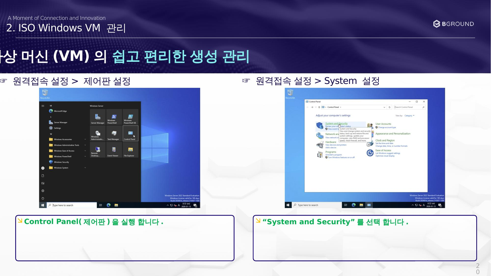
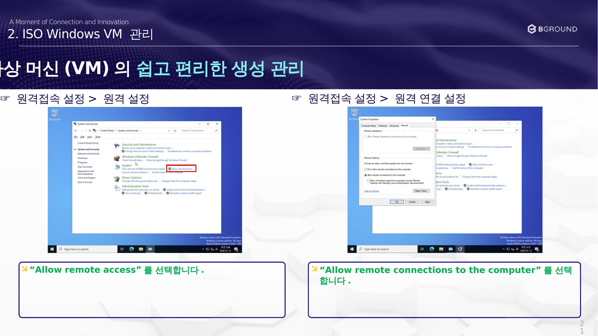
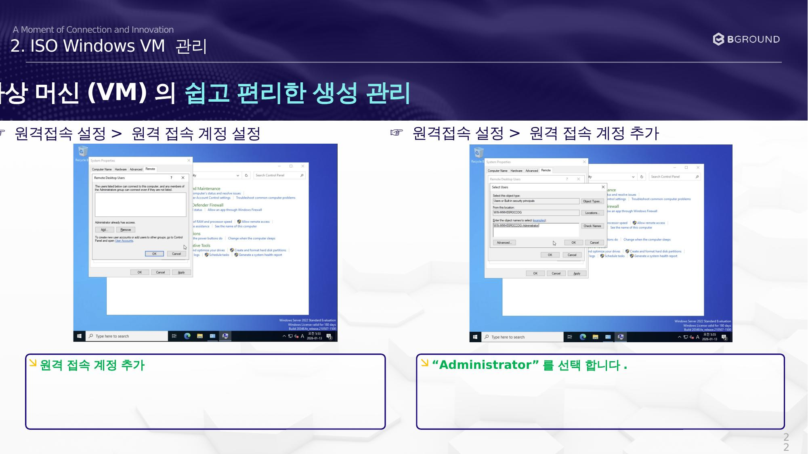
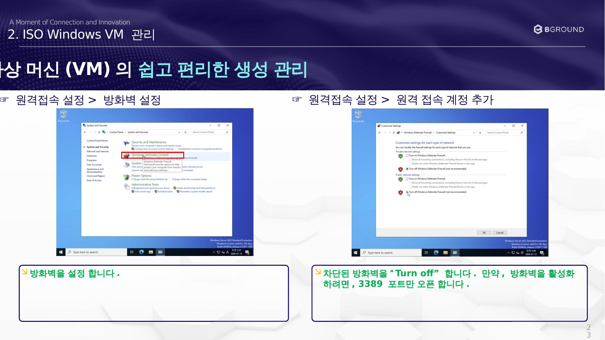
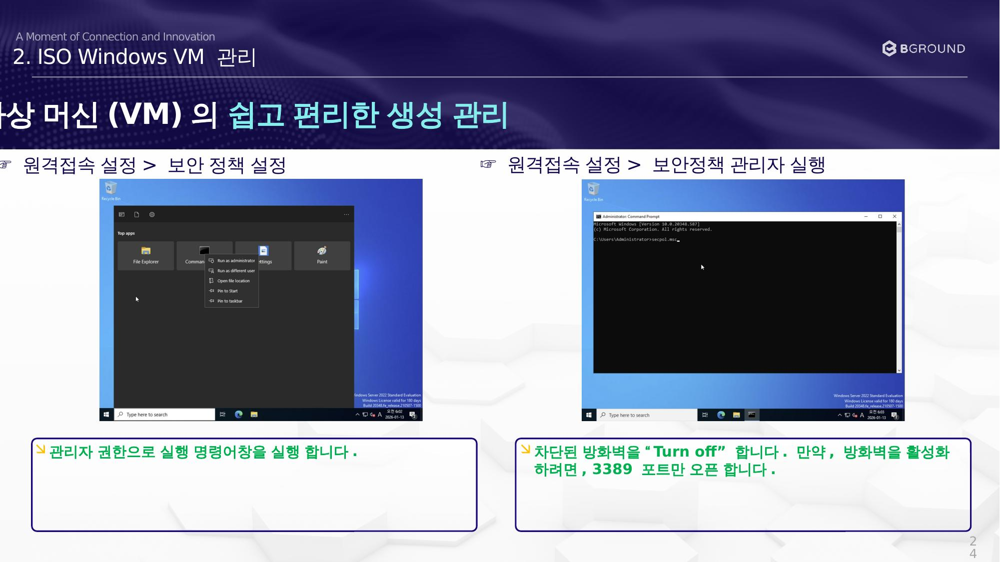
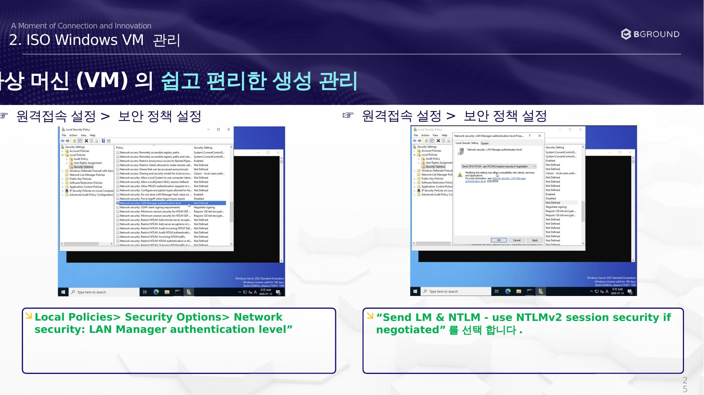

# 원격 접속 설정

Windows VM에 RDP 원격 접속을 설정합니다.

## 제어판 접속

### ☞ 원격 접속 설정 > 제어판 설정

1. **Control Panel(제어판)** 을 실행합니다.
2. **"System and Security"** 를 선택합니다.

---

## 원격 연결 허용

### ☞ 원격 접속 설정 > 원격 연결 설정

1. **"Allow remote access"** 를 선택합니다.
2. **"Allow remote connections to the computer"** 를 선택합니다.

---

## 원격 접속 계정 추가

### ☞ 원격 접속 설정 > 원격 접속 계정 추가

1. 원격 접속 계정을 추가합니다.
2. **"Administrator"** 를 선택합니다.

---

## 방화벽 설정

### ☞ 원격 접속 설정 > 방화벽 설정

1. 방화벽을 설정합니다.
2. 차단된 방화벽을 **"Turn off"** 합니다.

    !!! tip "방화벽 활성화 유지 시"
        방화벽을 활성화하려면 **3389 포트만 오픈**합니다.

---

## 보안 정책 관리자 실행

### ☞ 원격 접속 설정 > 보안 정책 관리자 실행

1. 관리자 권한으로 실행 명령어창을 실행합니다.

---

## 보안 정책 설정

### ☞ 원격 접속 설정 > 보안 정책 설정

경로: `Local Policies > Security Options > Network security: LAN Manager authentication level`

설정값: **"Send LM & NTLM - use NTLMv2 session security if negotiated"** 를 선택합니다.
