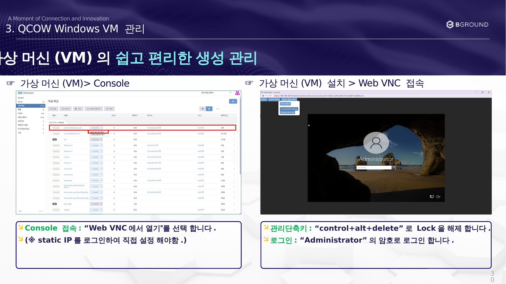

# Console 접속

Web VNC를 통해 가상머신에 접속합니다.

## 절차

### ☞ 가상 머신(VM) 설치 > Web VNC 접속

!!! note
    QCOW 방식은 static IP를 로그인하여 직접 설정해야 합니다.

1. Console 접속: **"Web VNC에서 열기"** 를 선택합니다.
2. 관리 단축키: `Ctrl + Alt + Delete` 로 Lock을 해제합니다.
3. 로그인: **"Administrator"** 의 암호로 로그인합니다.
