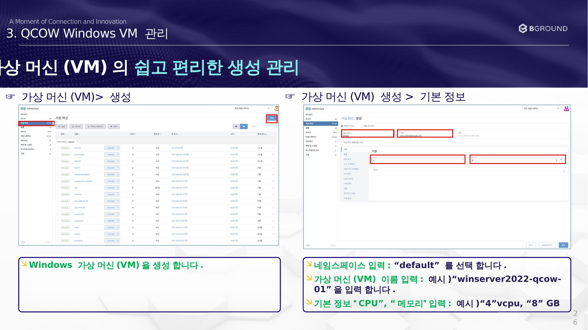
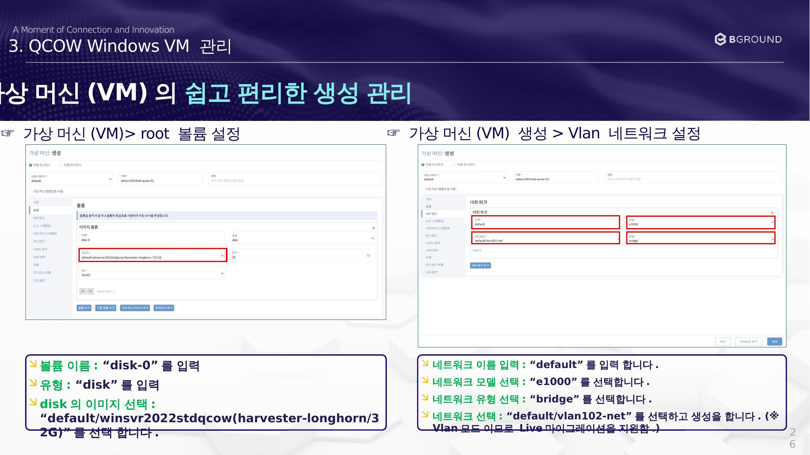

# VM 생성

QCOW2 이미지 기반 Windows 가상 머신을 생성합니다.

## 기본 정보 설정

### ☞ 가상 머신(VM) 생성 > 기본 정보

| 항목 | 입력값 |
|------|--------|
| 네임스페이스 | `default` |
| VM 이름 | 예시: `winserver2022-qcow-01` |
| CPU | 예시: `4` vCPU |
| 메모리 | 예시: `8` GB |

---

## 볼륨 및 네트워크 설정

### ☞ 가상 머신(VM) 생성 > root 볼륨 설정

| 항목 | 설정값 |
|------|--------|
| 볼륨 이름 | `disk-0` |
| 유형 | `disk` |
| 이미지 선택 | `default/winsvr2022stdqcow (harvester-longhorn/32G)` |

### ☞ 가상 머신(VM) 생성 > Vlan 네트워크 설정

| 항목 | 설정값 |
|------|--------|
| 네트워크 이름 | `default` |
| 네트워크 모델 | `e1000` |
| 네트워크 유형 | `bridge` |
| 네트워크 선택 | `default/vlan102-net` |

!!! success "Vlan 모드 지원"
    Vlan 모드이므로 **Live 마이그레이션**을 지원합니다.

설정 완료 후 **생성** 버튼을 클릭합니다.
