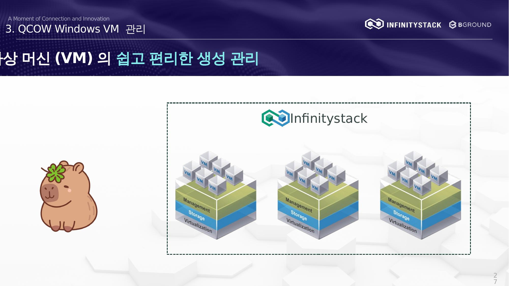

# 3. QCOW Windows VM 관리 — 개요

가상 머신(VM)의 쉽고 편리한 생성 및 관리 방법을 설명합니다.

## 절차 요약

| 단계 | 내용 |
|------|------|
| [1. VM 생성](create-vm.md) | 기본 정보, 볼륨, 네트워크 설정 |
| [2. Console 접속](console.md) | Web VNC 접속 및 로그인 |

## ISO 방식과의 차이점

| 항목 | ISO 방식 | QCOW 방식 |
|------|----------|-----------|
| 이미지 유형 | `.ISO` (설치 미디어) | `.qcow2` (사전 설치된 디스크 이미지) |
| OS 설치 필요 | ✅ 필요 | ❌ 불필요 |
| Live 마이그레이션 | 제한적 | ✅ Vlan 모드 지원 |
| IP 설정 | DHCP 자동 | Static IP 직접 설정 |
