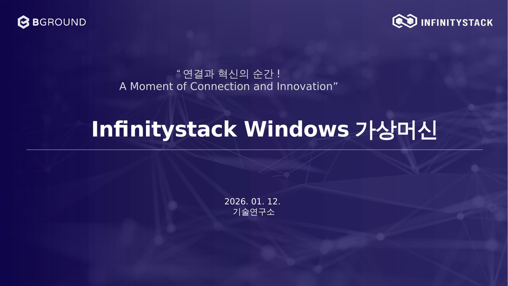
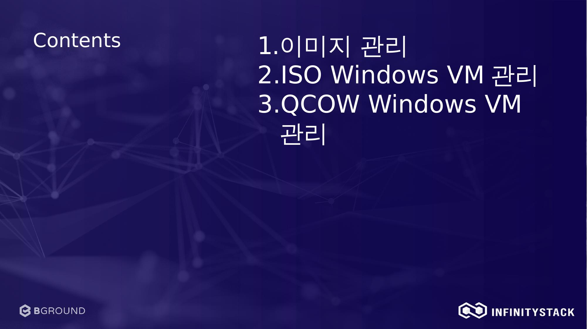

# Infinitystack Windows 가상머신

> *" 연결과 혁신의 순간 ! A Moment of Connection and Innovation"*

**작성일:** 2026. 01. 12. | **작성:** 기술연구소

---

## 소개

이 문서는 **Infinitystack** 플랫폼에서 Windows 가상머신(VM)을 생성하고 관리하는 방법을 설명합니다.

## 목차

| 챕터 | 설명 |
|------|------|
| [1. 이미지 관리](image-management/overview.md) | Windows ISO 이미지 파일 등록 및 상태 관리 |
| [2. ISO Windows VM 관리](iso-windows-vm/overview.md) | ISO 기반 Windows 가상머신 생성 및 설치 |
| [3. QCOW Windows VM 관리](qcow-windows-vm/overview.md) | QCOW2 이미지 기반 Windows 가상머신 관리 |

---

